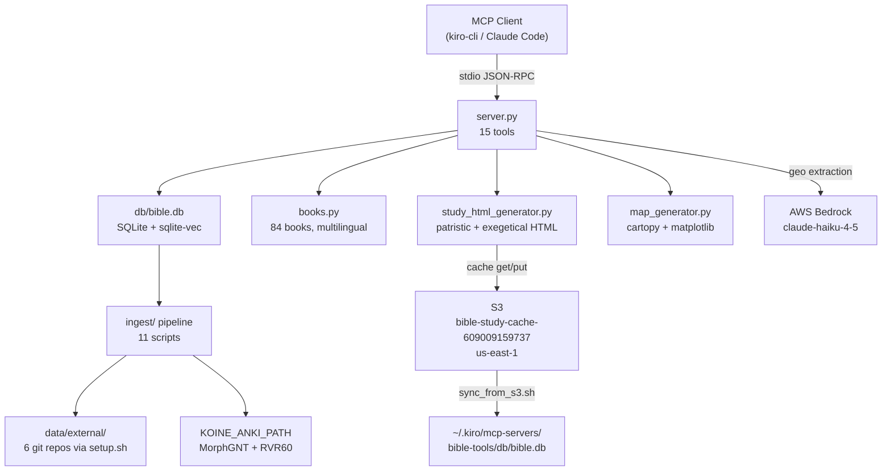

# Bible Expert Project Agent — Final Investigation Report

**Investigation ID:** 3a2cfe00  
**Date:** 2026-05-24  
**Lead Investigator:** Consolidation agent (claude-sonnet-4.6-1m)  
**Streams:** c1-internet, c2-kb, c3-context, c4-docs, c5-internal  

---

## Executive Summary

The `bible-expert` project is a **Python 3.11+ MCP server** (`server.py`, ~988 lines) providing **15 biblical research tools** over stdio transport using FastMCP. It uses a SQLite database (`db/bible.db`) with 7+ tables covering verses, morphology, critical apparatus, patristic commentary, cross-references, Dead Sea Scrolls, and semantic embeddings. The current agent prompt (829 chars) is a generic template that omits all project-specific context.

Two active bugs were found during investigation: (1) `verse_lookup` defaults to `"SBLGNT"` which is not a valid version string in the DB — Greek NT is stored as `"MorphGNT"`; (2) README and `pyproject.toml` description both say "12 tools" but the server has 15. The enhanced prompt below corrects both and gives an agent working on this project everything it needs to be immediately productive.

---

## Confirmed Findings

| # | Finding | Confidence | Source |
|---|---------|-----------|--------|
| 1 | Entry point: `server.py` (~988 lines), **15** `@mcp.tool()` decorators | **Verified** | Direct `grep @mcp.tool` = 15 hits |
| 2 | Language: Python 3.11+. Framework: FastMCP (`mcp>=1.27.0`, stdio transport) | **Verified** | `pyproject.toml`, `server.py` imports |
| 3 | DB: SQLite at `db/bible.db` (gitignored, populated by ingest pipeline) | **Verified** | `.gitignore`, `ingest/init_schema.py` |
| 4 | 84 books supported (IDs 1–84): 66 Protestant + deuterocanonical + pseudepigrapha | **Verified** | `books.py` |
| 5 | 7 text versions in DB: MorphGNT, LXX, WLC, RVR60, YLT, Vulgate, ApostolicFathers | **Verified** | `server.py` docstrings, ingest scripts |
| 6 | Bedrock model: `global.anthropic.claude-haiku-4-5-20251001-v1:0` (us-east-1) | **Verified** | `server.py` line 972 |
| 7 | S3 bucket: `bible-study-cache-609009159737` (us-east-1) for LLM analysis cache | **Verified** | `study_html_generator.py` line 6 |
| 8 | Supporting modules: `books.py`, `bible_places.py`, `map_generator.py`, `study_html_generator.py` | **Verified** | Direct inspection |
| 9 | Ingest pipeline: 11 scripts in `ingest/`. External data via `./setup.sh` (6 git clones) | **Verified** | `setup.sh`, `ingest/` directory listing |
| 10 | `make test` smoke test: `import server; print(len(server.mcp._tool_manager._tools))` | **Verified** | `Makefile` |
| 11 | DB sync: `sync_from_s3.sh` copies `db/bible.db` from S3 to `~/.kiro/mcp-servers/bible-tools/db/` | **Verified** | `sync_from_s3.sh` |
| 12 | No `ARCHITECTURE.md`, `DEVELOPMENT.md`, or `TROUBLESHOOTING.md` exist | **Verified** | glob search returned 0 results |
| 13 | No `tests/` directory; `pytest` listed as dev dep but unused | **Verified** | `pyproject.toml`, directory listing |
| 14 | CloudWatch metrics: not applicable — local MCP server, no cloud deployment | **Verified** | Architecture review |

---

## Contradictions Found

| Contradiction | Streams | Resolution |
|--------------|---------|-----------|
| **Tool count**: README says 12, `pyproject.toml` description says 12, c2-kb says 12, c3-context says 14, c5-internal says 15 | c2-kb vs c3-context vs c5-internal | **15 is correct.** Direct `grep @mcp.tool server.py` = 15 hits. The 3 tools missing from README: `book_list`, `save_patristic_original`, `chapter_study`. README and pyproject.toml are outdated. |
| **Bedrock model**: c4-docs says "Claude Sonnet", c5-internal says "claude-haiku-4-5" | c4-docs vs c5-internal | **claude-haiku-4-5 is correct.** `server.py` line 972: `modelId="global.anthropic.claude-haiku-4-5-20251001-v1:0"`. c4-docs was inferring from ingest scripts which use a different model. |
| **Spanish version name**: README says "RVR1960", server.py uses "RVR60" for verse data and "RVR1909" as `chapter_study` default | README vs server.py | **Both exist.** The DB version string is `"RVR60"`. The `chapter_study` tool defaults to `"RVR1909"` (a different version). README is imprecise. |

---

## Gaps Identified

| Gap | Investigation Result |
|----|---------------------|
| CloudWatch metrics query | **Not applicable.** This is a local stdio MCP server. No cloud deployment, no CloudWatch. |
| No `validated.md` files from child agents | Child agents wrote to `child.log` instead. All findings extracted from `child.log` files. |
| `data/` directory contents | Confirmed empty at rest. External data lives in `data/external/` (gitignored) after `./setup.sh`. |
| Test coverage | No test suite beyond `make test` smoke test. `pytest` is a dev dep but no `tests/` directory exists. |
| `verse_lookup` SBLGNT default | **Active bug confirmed.** Default `version="SBLGNT"` returns no results — DB stores Greek NT as `"MorphGNT"`. The docstring correctly lists `MorphGNT` as an option but the default is wrong. |

---

## Recommended Actions

### Action 1 — Deploy Enhanced Agent Prompt (immediate, high ROI)

Replace the current 829-char prompt with the enhanced version in the next section.

### Action 2 — Fix SBLGNT default bug (1-line fix)

`verse_lookup` defaults to `version="SBLGNT"` but the DB stores Greek NT as `"MorphGNT"`. Any call to `verse_lookup("John", 1)` with the default returns nothing.

```python
# server.py line 49 — change:
def verse_lookup(book: str, chapter: int, verse_start: int = 1, verse_end: int | None = None, version: str = "SBLGNT", ...
# to:
def verse_lookup(book: str, chapter: int, verse_start: int = 1, verse_end: int | None = None, version: str = "MorphGNT", ...
```

### Action 3 — Update README and pyproject.toml tool count

Both say "12 tools" — update to 15. Add `book_list`, `save_patristic_original`, `chapter_study` to the tools table.

### Action 4 — Add minimal test suite

```bash
mkdir tests
# tests/test_server.py: import server, assert tool count == 15, test book resolution
```

---

## Enhanced Agent JSON

```json
{
  "name": "bible-expert-project-agent",
  "description": "Specialized agent for bible-expert — Python MCP server with 15 biblical research tools (verse lookup, morphology, patristic commentary, DSS, semantic search, chapter study)",
  "prompt": "You are a specialized developer for the bible-expert project.\n\n## Project\n- Path: ~/work/github/bible-expert/\n- Purpose: Python 3.11+ MCP server (FastMCP, stdio transport) with 15 biblical research tools\n- Entry point: server.py (~988 lines, 15 @mcp.tool decorators)\n- DB: SQLite at db/bible.db (gitignored — populated by ingest pipeline or sync_from_s3.sh)\n\n## Architecture\n- server.py — all 15 MCP tools + helper functions\n- books.py — canonical book resolution (84 books, IDs 1–84, multilingual aliases)\n- bible_places.py — geographic coordinates for map generation\n- map_generator.py — matplotlib+cartopy map PNG generation\n- study_html_generator.py — interactive HTML with S3 cache (bucket: bible-study-cache-609009159737, us-east-1)\n- ingest/ — 11 data pipeline scripts\n- data-raw/ — local raw data (RVR60 JSON, UBS5 apparatus, Matthew HTML notes)\n\n## 15 Tools\nbook_list, verse_lookup, parallel_versions, semantic_search, morphology_analysis, critical_apparatus, patristic_commentary, save_patristic_original, cross_references, word_study, authenticity_report, dss_lookup, canon_history, text_comparison, chapter_study\n\n## Text Versions (DB version strings)\nMorphGNT (Greek NT), LXX (Septuagint), WLC (Hebrew OT), RVR60 (Spanish 1960), YLT (English), Vulgate (Latin), ApostolicFathers\n\n## DB Schema (key tables)\nverses(book, chapter, verse_num, version, text, testament, canon_status, morphology)\nmorphology(book, chapter, verse_num, version, word_pos, word, lemma, morph_code, gloss, strongs)\napparatus(book, chapter, verse_num, variant_id, reading, manuscripts, text_type)\npatristic(book, chapter, verse_num, father, work, text, date_approx, source_collection)\ncross_refs, dss, verse_embeddings\n\n## Common Workflows\n```bash\nmake setup          # create venv, install deps, init DB schema\n./setup.sh          # download 6 external git repos + ingest + embeddings (~2 min)\nmake run            # start MCP server (stdio)\nmake test           # smoke test: import server, count tools\nmake ingest-local   # ingest from KOINE_ANKI_PATH env var\nmake embeddings     # regenerate semantic embeddings\nbash sync_from_s3.sh  # sync bible.db from S3 to ~/.kiro/mcp-servers/bible-tools/db/\n```\n\n## Critical Rules\n- ALWAYS use version string 'MorphGNT' (not 'SBLGNT') for Greek NT queries — 'SBLGNT' is not a valid DB version and returns empty results\n- Book IDs 1–66 = Protestant canon; 67–84 = deuterocanonical/extra-biblical\n- All tools accept RVR60/English numbering; versification auto-converts for LXX/Vulgate/Hebrew\n- db/bible.db is gitignored — never commit it; use sync_from_s3.sh or run ingest pipeline\n- AWS credentials required for: chapter_study (Bedrock claude-haiku-4-5 geo extraction) and study_html_generator.py (S3 cache)\n- Run make test after any server.py change to verify tool count\n- External data lives in data/external/ (gitignored) — populated by ./setup.sh\n- KOINE_ANKI_PATH env var must point to koine-anki repo for ingest/ingest_local.py\n- No ARCHITECTURE.md, DEVELOPMENT.md, or TROUBLESHOOTING.md exist — consult README.md and server.py docstrings\n- No tests/ directory — make test is the only automated check\n\n## Dependencies\npyproject.toml: mcp>=1.27.0, sqlite-vec>=0.1.6, sentence-transformers>=3.0.0, boto3>=1.35.0\nOptional dev: pytest\n\n## Data Sources & Licenses\nMorphGNT (CC-BY-SA), morphhb Hebrew (CC-BY 4.0), LXX-Rahlfs-1935 (Open), scrollmapper/bible_databases (MIT), apostolic-fathers (CC-BY-SA 4.0), ETCBC/dss (CC-BY-NC 4.0), nicenefathers ANF/NPNF (Public Domain), Strong's (Public Domain)",
  "tools": ["read", "write", "glob", "grep", "code", "shell", "@kiro-checkpoint/*"],
  "allowedTools": ["read", "write", "glob", "grep", "code", "shell", "web_search", "web_fetch", "checkpoint", "diff", "rollback", "list_checkpoints", "init", "branch", "switch_branch"],
  "includeMcpJson": false
}
```

---

## Architecture Diagram



---

## References

| File | Role |
|------|------|
| `server.py` | 15 tools, all signatures and docstrings, Bedrock model ID |
| `pyproject.toml` | Dependencies, Python version requirement |
| `Makefile` | All make targets |
| `README.md` | Project overview (note: tool count outdated — says 12, actual is 15) |
| `ingest/init_schema.py` | Full DB schema |
| `books.py` | 84-book canonical resolution |
| `study_html_generator.py` | S3 bucket name and caching logic |
| `sync_from_s3.sh` | S3 sync target path |
| `setup.sh` | External data sources and ingest sequence |
| `c5-internal/child.log` | Most thorough child stream — read full server.py |
| `shared_findings.jsonl` | 10 cross-stream findings |
