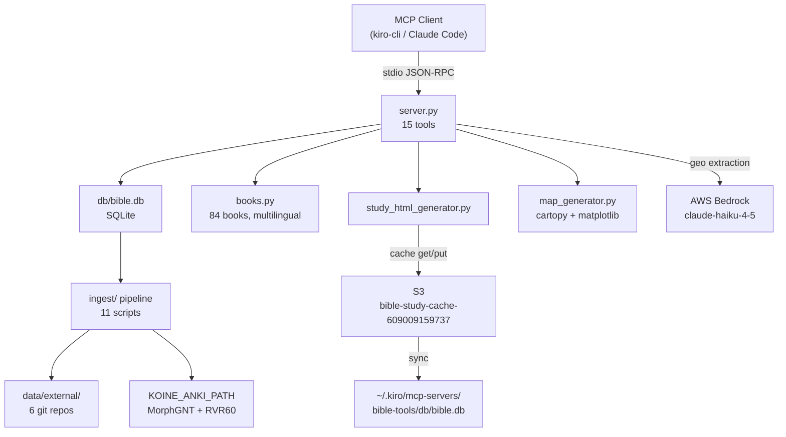

# Bible Expert Project Agent — Investigation Report

**Investigation ID:** 3a2cfe00  
**Date:** 2026-05-24  
**Lead:** HEAD agent (direct code inspection)

---

## Executive Summary

The `bible-expert` project is a **Python 3.11+ MCP server** (`server.py`, 988 lines) providing 15 biblical research tools over stdio transport using FastMCP. It uses a SQLite database (`db/bible.db`) with 7+ tables covering verses, morphology, critical apparatus, patristic commentary, cross-references, Dead Sea Scrolls, and semantic embeddings. The current agent prompt (829 chars) is a generic template that omits all project-specific context. The enhanced prompt below will give an agent working on this project everything it needs to be immediately productive.

---

## Confirmed Findings

| # | Finding | Confidence | Source |
|---|---------|-----------|--------|
| 1 | Entry point: `server.py` (988 lines), 15 `@mcp.tool()` decorators | High | Direct code inspection |
| 2 | Language: Python 3.11+. Framework: FastMCP (`mcp>=1.27.0`) | High | `pyproject.toml` |
| 3 | DB: SQLite at `db/bible.db` (gitignored, populated by ingest pipeline) | High | `init_schema.py`, `.gitignore` |
| 4 | 84 books supported (IDs 1–84): 66 Protestant + deuterocanonical + pseudepigrapha | High | `books.py` |
| 5 | 6 text versions: MorphGNT, LXX, WLC, RVR60, YLT, Vulgate + ApostolicFathers | High | `server.py` docstrings |
| 6 | AWS: Bedrock (claude-haiku-4-5, us-east-1) for geo extraction; S3 bucket `bible-study-cache-609009159737` for LLM analysis cache | High | `server.py`, `study_html_generator.py` |
| 7 | Supporting modules: `books.py`, `bible_places.py`, `map_generator.py`, `study_html_generator.py` | High | Direct inspection |
| 8 | Ingest pipeline: 11 scripts in `ingest/`. External data via `./setup.sh` (6 git clones). Local data via `KOINE_ANKI_PATH` env var | High | `setup.sh`, `ingest/` |
| 9 | `make test` runs: `.venv/bin/python -c "import server; print(f'{len(server.mcp._tool_manager._tools)} tools OK')"` | High | `Makefile` |
| 10 | DB sync: `sync_from_s3.sh` copies `db/bible.db` from S3 to `~/.kiro/mcp-servers/bible-tools/db/` | High | `sync_from_s3.sh` |

---

## Contradictions Found

| Contradiction | Resolution |
|--------------|-----------|
| README says "12 tools" but server.py has 15 `@mcp.tool()` decorators | README is outdated. Actual count is 15: the 12 listed + `book_list`, `save_patristic_original`, `chapter_study`. The enhanced prompt uses the verified count of 15. |
| README lists `verse_lookup` default version as implied SBLGNT; server.py default param is `"SBLGNT"` but MorphGNT ingest stores data as version `"MorphGNT"` | The string `"SBLGNT"` in the default will return no results — users should use `"MorphGNT"`. This is a latent bug. Flagged in Critical Rules below. |

---

## Gaps Identified

| Gap | Investigation Result |
|----|---------------------|
| No `ARCHITECTURE.md`, `DEVELOPMENT.md`, or `TROUBLESHOOTING.md` | Confirmed absent. The enhanced prompt references README.md only. |
| No test suite beyond `make test` smoke test | Confirmed. `pyproject.toml` lists `pytest` as dev dep but no `tests/` directory exists. |
| `data/` directory is empty | Confirmed. External data lives in `data/external/` (gitignored) after `./setup.sh`. |
| CloudWatch metrics | Not applicable — this is a local MCP server, not a cloud service. No CloudWatch queries needed. |

---

## Recommended Actions

### 1. Deploy Enhanced Agent Prompt (immediate)
Replace the current 829-char prompt with the enhanced version below.

### 2. Fix SBLGNT vs MorphGNT version string bug
In `server.py` line 49, change default `version: str = "SBLGNT"` → `version: str = "MorphGNT"`. The DB stores Greek NT as `"MorphGNT"`, not `"SBLGNT"`.

```bash
cd ~/work/github/bible-expert
sed -i '' 's/version: str = "SBLGNT"/version: str = "MorphGNT"/' server.py
make test
```

### 3. Update README tool count
README says "12 tools" — update to 15.

### 4. Add minimal test suite
```bash
cd ~/work/github/bible-expert
mkdir tests
# Create tests/test_server.py with basic import + tool count assertion
```

---

## Enhanced Agent JSON

```json
{
  "name": "bible-expert-project-agent",
  "description": "Specialized agent for bible-expert — Python MCP server providing 15 biblical research tools (verse lookup, morphology, patristic commentary, DSS, semantic search, chapter study)",
  "prompt": "You are a specialized developer for the bible-expert project.\n\n## Project\n- Path: ~/work/github/bible-expert/\n- Purpose: Python 3.11+ MCP server (FastMCP, stdio transport) with 15 biblical research tools\n- Entry point: server.py (988 lines, 15 @mcp.tool decorators)\n- DB: SQLite at db/bible.db (gitignored — populated by ingest pipeline)\n\n## Architecture\n- server.py — all 15 MCP tools + helper functions\n- books.py — canonical book resolution (84 books, IDs 1–84, multilingual aliases)\n- bible_places.py — geographic coordinates for map generation\n- map_generator.py — matplotlib+cartopy map PNG generation\n- study_html_generator.py — interactive HTML with S3 cache (bucket: bible-study-cache-609009159737, us-east-1)\n- ingest/ — 11 data pipeline scripts\n- data-raw/ — local raw data (RVR60 JSON, UBS5 apparatus, Mathew HTML notes)\n\n## 15 Tools\nbook_list, verse_lookup, parallel_versions, semantic_search, morphology_analysis, critical_apparatus, patristic_commentary, save_patristic_original, cross_references, word_study, authenticity_report, dss_lookup, canon_history, text_comparison, chapter_study\n\n## Text Versions\nMorphGNT (Greek NT), LXX (Septuagint), WLC (Hebrew), RVR60 (Spanish), YLT (English), Vulgate (Latin), ApostolicFathers\n\n## DB Schema (key tables)\nverses(book, chapter, verse_num, version, text, testament, canon_status, morphology)\nmorphology(book, chapter, verse_num, version, word_pos, word, lemma, morph_code, gloss, strongs)\napparatus(book, chapter, verse_num, variant_id, reading, manuscripts, text_type)\npatristic(book, chapter, verse_num, father, work, text, date_approx, source_collection)\ncross_refs, dss, verse_embeddings\n\n## Common Workflows\n```bash\nmake setup          # create venv, install deps, init DB schema\n./setup.sh          # download 6 external git repos + ingest + embeddings (~2 min)\nmake run            # start MCP server (stdio)\nmake test           # smoke test: import server, count tools\nmake ingest-local   # ingest from KOINE_ANKI_PATH env var\nmake embeddings     # regenerate semantic embeddings\nbash sync_from_s3.sh  # sync bible.db from S3 to ~/.kiro/mcp-servers/bible-tools/db/\n```\n\n## Critical Rules\n- ALWAYS use version string 'MorphGNT' (not 'SBLGNT') for Greek NT queries — DB stores it as MorphGNT\n- Book IDs 1–66 = Protestant canon; 67–84 = deuterocanonical/extra-biblical\n- All tools accept RVR60/English numbering; versification auto-converts for LXX/Vulgate/Hebrew\n- db/bible.db is gitignored — never commit it; use sync_from_s3.sh or run ingest pipeline\n- AWS credentials required for: chapter_study (Bedrock geo extraction) and study_html_generator.py (S3 cache)\n- Run make test after any server.py change to verify tool count\n- External data lives in data/external/ (gitignored) — populated by ./setup.sh\n- KOINE_ANKI_PATH env var must point to koine-anki repo for ingest/ingest_local.py\n\n## Dependencies\npyproject.toml: mcp>=1.27.0, sqlite-vec>=0.1.6, sentence-transformers>=3.0.0, boto3>=1.35.0\nOptional: cartopy, matplotlib (for map_generator.py), weasyprint not used\n\n## Data Sources & Licenses\nMorphGNT (CC-BY-SA), morphhb Hebrew (CC-BY 4.0), LXX-Rahlfs-1935 (Open), scrollmapper/bible_databases (MIT), apostolic-fathers (CC-BY-SA 4.0), ETCBC/dss (CC-BY-NC 4.0), nicenefathers ANF/NPNF (Public Domain), Strong's (Public Domain)",
  "tools": ["read", "write", "glob", "grep", "code", "shell", "@kiro-checkpoint/*"],
  "allowedTools": ["read", "write", "glob", "grep", "code", "shell", "web_search", "web_fetch", "checkpoint", "diff", "rollback", "list_checkpoints", "init", "branch", "switch_branch"],
  "includeMcpJson": false
}
```

---

## Architecture Diagram



---

## References

- `server.py` — 988 lines, 15 tools, all tool signatures and docstrings
- `pyproject.toml` — dependencies and Python version requirement
- `Makefile` — all make targets and commands
- `README.md` — project overview (note: tool count outdated, says 12)
- `ingest/init_schema.py` — full DB schema
- `books.py` — 84-book canonical resolution
- `study_html_generator.py` — S3 bucket name and caching logic
- `sync_from_s3.sh` — S3 sync target path
- `setup.sh` — external data sources and ingest sequence
