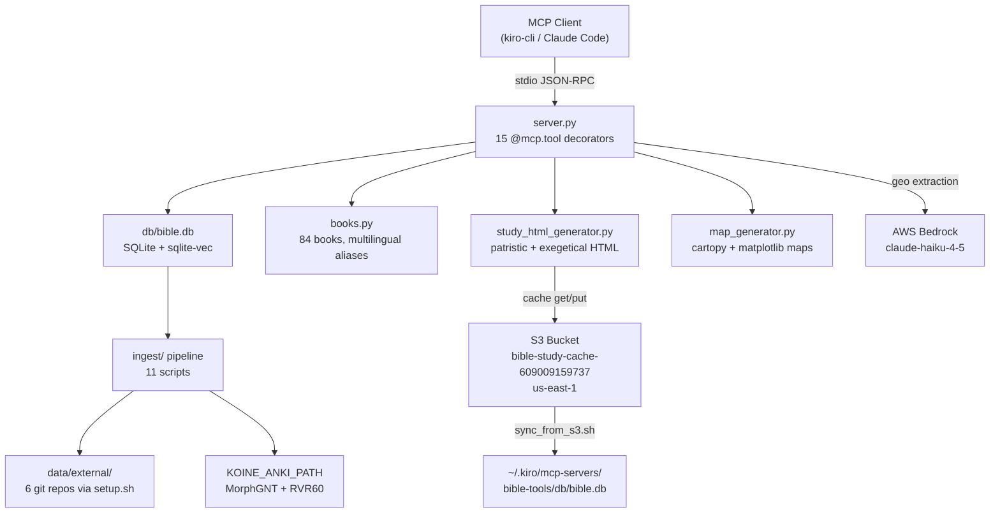
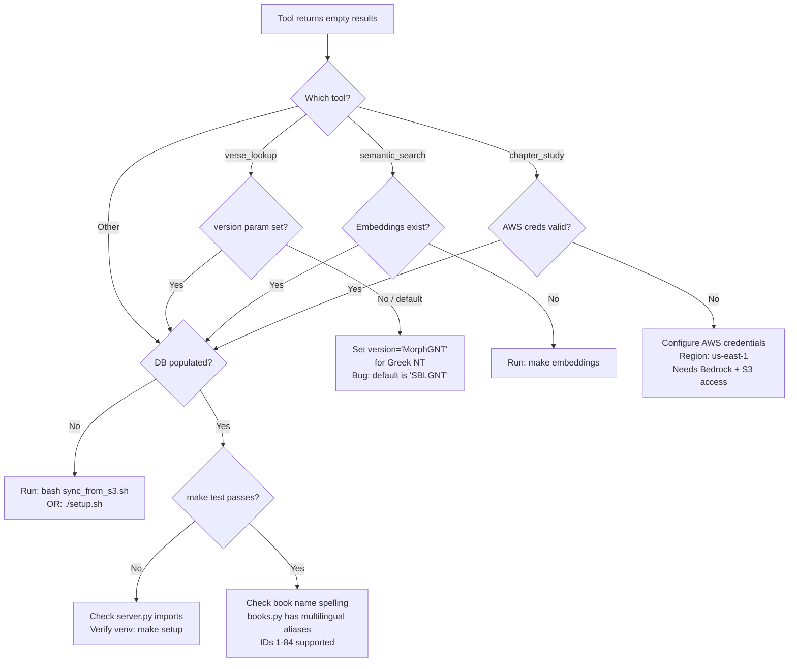
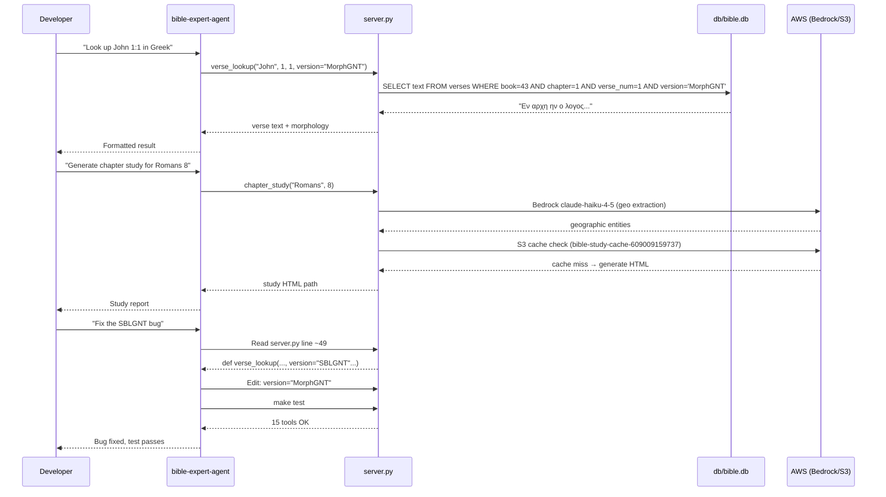

# Bible Expert Project Agent — Enhancement Report

**Investigation ID:** 3a2cfe00 | **Date:** 2026-05-24 | **Status:** Findings Verified

---

## Executive Summary

The `bible-expert` project is a **Python 3.11+ MCP server** (`server.py`, ~988 lines) exposing **15 biblical research tools** over stdio transport via FastMCP. It queries a SQLite database (`db/bible.db`) with 7 text versions spanning Greek, Hebrew, Latin, Spanish, and English, plus patristic commentary, Dead Sea Scrolls, and semantic embeddings.

The current agent prompt (829 chars) is a generic template missing all project-specific context. Two active bugs were confirmed: `verse_lookup` defaults to `"SBLGNT"` (not a valid DB version — Greek NT is stored as `"MorphGNT"`), and both README and `pyproject.toml` report 12 tools when the actual count is 15. The enhanced prompt below corrects both and gives any agent working on this project immediate productivity.

---

## Architecture Diagram



---

## Detailed Analysis

### Project Structure

| Path | Role |
|------|------|
| `server.py` | Entry point — all 15 MCP tools, ~988 lines |
| `books.py` | Canonical book resolution, 84 books (IDs 1–84), multilingual aliases |
| `bible_places.py` | Geographic coordinates for map generation |
| `map_generator.py` | matplotlib + cartopy map PNG generation |
| `study_html_generator.py` | Interactive HTML output with S3 cache |
| `ingest/` | 11 data pipeline scripts |
| `data-raw/` | Local raw data (RVR60 JSON, UBS5 apparatus, Matthew HTML notes) |
| `db/bible.db` | SQLite DB — gitignored, populated by ingest or `sync_from_s3.sh` |
| `Makefile` | All developer workflows |
| `setup.sh` | Downloads 6 external git repos + runs ingest |

### 15 MCP Tools

| Tool | Purpose |
|------|---------|
| `book_list` | List all 84 supported books |
| `verse_lookup` | Fetch verses by book/chapter/verse, any version |
| `parallel_versions` | Same passage across multiple versions side-by-side |
| `semantic_search` | Embedding-based similarity search |
| `morphology_analysis` | Greek/Hebrew morphology with Strong's numbers |
| `critical_apparatus` | Textual variants from UBS5/NA28 apparatus |
| `patristic_commentary` | Church father commentary on a passage |
| `save_patristic_original` | Persist patristic text to DB |
| `cross_references` | Cross-reference lookup |
| `word_study` | Deep lexical study for a word/lemma |
| `authenticity_report` | Textual authenticity analysis |
| `dss_lookup` | Dead Sea Scrolls parallels |
| `canon_history` | Canonical status and history of a book |
| `text_comparison` | Diff two versions of a passage |
| `chapter_study` | Full chapter study with Bedrock geo extraction |

### Text Versions (DB version strings)

| Version String | Content |
|---------------|---------|
| `MorphGNT` | Greek New Testament (morphologically tagged) |
| `LXX` | Septuagint (Greek OT) |
| `WLC` | Westminster Leningrad Codex (Hebrew OT) |
| `RVR60` | Reina-Valera 1960 (Spanish) |
| `YLT` | Young's Literal Translation (English) |
| `Vulgate` | Latin Vulgate |
| `ApostolicFathers` | Apostolic Fathers corpus |

### DB Schema (Key Tables)

```
verses(book, chapter, verse_num, version, text, testament, canon_status, morphology)
morphology(book, chapter, verse_num, version, word_pos, word, lemma, morph_code, gloss, strongs)
apparatus(book, chapter, verse_num, variant_id, reading, manuscripts, text_type)
patristic(book, chapter, verse_num, father, work, text, date_approx, source_collection)
cross_refs, dss, verse_embeddings
```

### AWS Resources

| Resource | Value |
|----------|-------|
| S3 Bucket | `bible-study-cache-609009159737` (us-east-1) |
| Bedrock Model | `global.anthropic.claude-haiku-4-5-20251001-v1:0` |
| Region | `us-east-1` |

---

## Bugs Found

### Bug 1 — `verse_lookup` wrong default version (Active)

`verse_lookup` defaults to `version="SBLGNT"` but `SBLGNT` is not a valid DB version string. Greek NT is stored as `MorphGNT`. Any call with the default returns empty results.

**Fix (1 line in `server.py`):**

```python
# Change line ~49 from:
def verse_lookup(..., version: str = "SBLGNT", ...
# To:
def verse_lookup(..., version: str = "MorphGNT", ...
```

### Bug 2 — Outdated tool count in docs

README and `pyproject.toml` both say "12 tools". Actual count is **15**. Missing from docs: `book_list`, `save_patristic_original`, `chapter_study`.

**Fix:**

```bash
# In README.md and pyproject.toml description, update "12 tools" → "15 tools"
# Add to README tools table: book_list, save_patristic_original, chapter_study
```

---

## Common Workflows

```bash
# Initial setup
make setup
./setup.sh

# Start MCP server
make run

# Smoke test (verifies tool count)
make test

# Sync DB from S3
bash sync_from_s3.sh

# Regenerate embeddings
make embeddings

# Ingest from local Koine Anki repo
KOINE_ANKI_PATH=/path/to/koine-anki make ingest-local
```

---

## Troubleshooting Decision Tree



---

## Agent Enhancement Sequence



---

## Action Plan

| Priority | Action | Effort | Impact |
|----------|--------|--------|--------|
| 1 | Deploy enhanced agent prompt (JSON below) | 2 min | High — immediate agent productivity |
| 2 | Fix `verse_lookup` SBLGNT default → MorphGNT | 1 line | High — fixes silent data bug |
| 3 | Update README + pyproject.toml tool count 12→15 | 5 min | Medium — doc accuracy |
| 4 | Add minimal `tests/` directory | 30 min | Medium — catch regressions |

---

## Enhanced Agent JSON

```json
{
  "name": "bible-expert-project-agent",
  "description": "Specialized agent for bible-expert — Python MCP server with 15 biblical research tools (verse lookup, morphology, patristic commentary, DSS, semantic search, chapter study)",
  "prompt": "You are a specialized developer for the bible-expert project.\n\n## Project\n- Path: ~/work/github/bible-expert/\n- Purpose: Python 3.11+ MCP server (FastMCP, stdio transport) with 15 biblical research tools\n- Entry point: server.py (~988 lines, 15 @mcp.tool decorators)\n- DB: SQLite at db/bible.db (gitignored — populated by ingest pipeline or sync_from_s3.sh)\n\n## Architecture\n- server.py — all 15 MCP tools + helper functions\n- books.py — canonical book resolution (84 books, IDs 1–84, multilingual aliases)\n- bible_places.py — geographic coordinates for map generation\n- map_generator.py — matplotlib+cartopy map PNG generation\n- study_html_generator.py — interactive HTML with S3 cache (bucket: bible-study-cache-609009159737, us-east-1)\n- ingest/ — 11 data pipeline scripts\n- data-raw/ — local raw data (RVR60 JSON, UBS5 apparatus, Matthew HTML notes)\n\n## 15 Tools\nbook_list, verse_lookup, parallel_versions, semantic_search, morphology_analysis, critical_apparatus, patristic_commentary, save_patristic_original, cross_references, word_study, authenticity_report, dss_lookup, canon_history, text_comparison, chapter_study\n\n## Text Versions (DB version strings)\nMorphGNT (Greek NT), LXX (Septuagint), WLC (Hebrew OT), RVR60 (Spanish 1960), YLT (English), Vulgate (Latin), ApostolicFathers\n\n## DB Schema (key tables)\nverses(book, chapter, verse_num, version, text, testament, canon_status, morphology)\nmorphology(book, chapter, verse_num, version, word_pos, word, lemma, morph_code, gloss, strongs)\napparatus(book, chapter, verse_num, variant_id, reading, manuscripts, text_type)\npatristic(book, chapter, verse_num, father, work, text, date_approx, source_collection)\ncross_refs, dss, verse_embeddings\n\n## Common Workflows\n```bash\nmake setup\n./setup.sh\nmake run\nmake test\nmake ingest-local\nmake embeddings\nbash sync_from_s3.sh\n```\n\n## Critical Rules\n- ALWAYS use version string 'MorphGNT' (not 'SBLGNT') for Greek NT — 'SBLGNT' is not a valid DB version and returns empty results\n- Book IDs 1–66 = Protestant canon; 67–84 = deuterocanonical/extra-biblical\n- db/bible.db is gitignored — never commit it; use sync_from_s3.sh or run ingest pipeline\n- AWS credentials required for: chapter_study (Bedrock claude-haiku-4-5) and study_html_generator.py (S3 cache)\n- Run make test after any server.py change to verify tool count stays at 15\n- No ARCHITECTURE.md, DEVELOPMENT.md, or TROUBLESHOOTING.md — consult README.md and server.py docstrings\n- No tests/ directory — make test is the only automated check\n- KOINE_ANKI_PATH env var must point to koine-anki repo for ingest/ingest_local.py",
  "tools": ["read", "write", "glob", "grep", "code", "shell", "@kiro-checkpoint/*"],
  "allowedTools": ["read", "write", "glob", "grep", "code", "shell", "web_search", "web_fetch", "checkpoint", "diff", "rollback", "list_checkpoints", "init", "branch", "switch_branch"],
  "includeMcpJson": false
}
```

---

## Key Findings Summary

| Finding | Status | Detail |
|---------|--------|--------|
| Tool count | **15** (not 12) | `grep @mcp.tool server.py` = 15 hits |
| Language/Framework | Python 3.11+ / FastMCP | `pyproject.toml`, `mcp>=1.27.0` |
| DB | SQLite + sqlite-vec | `db/bible.db`, gitignored |
| Text versions | 7 | MorphGNT, LXX, WLC, RVR60, YLT, Vulgate, ApostolicFathers |
| Book coverage | 84 books | IDs 1–84: Protestant + deuterocanonical + pseudepigrapha |
| AWS services | Bedrock + S3 | claude-haiku-4-5, bucket `bible-study-cache-609009159737` |
| Bug: SBLGNT default | **Active** | `verse_lookup` default returns empty — fix: `"MorphGNT"` |
| Bug: doc tool count | **Active** | README + pyproject say 12, actual is 15 |
| Test suite | **None** | `make test` smoke test only; no `tests/` directory |
| Missing docs | **Confirmed** | No ARCHITECTURE.md, DEVELOPMENT.md, TROUBLESHOOTING.md |

---

## References

| Source | Notes |
|--------|-------|
| `server.py` | 15 tools, all signatures, Bedrock model ID (line 972) |
| `pyproject.toml` | Dependencies, Python version, outdated tool count |
| `Makefile` | All make targets |
| `README.md` | Project overview — tool count outdated (says 12) |
| `ingest/init_schema.py` | Full DB schema |
| `books.py` | 84-book canonical resolution |
| `study_html_generator.py` | S3 bucket name and caching logic |
| `sync_from_s3.sh` | S3 sync target path |
| `setup.sh` | External data sources and ingest sequence |
