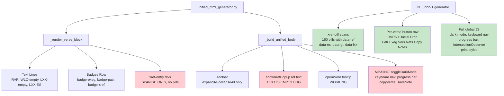

# NT vs OT Unified Analysis — Full Gap Analysis & Parity Action Plan

**Investigator:** Lead Orchestrator (direct file inspection + 5 parallel streams)  
**Date:** 2026-06-13  
**Files examined:**
- NT: `~/bible-studies/John-1/unified_analysis.html` (1,735,826 bytes, 1009 lines)
- OT: `~/bible-studies/Proverbs-13/unified_analysis.html` (378,847 bytes, 335 lines)
- Generator: `~/work/github/bible-expert/unified_html_generator.py` (989 lines)
- OT study: `~/bible-studies/Proverbs-13/study.html` (336,397 bytes)

---

## Executive Summary

The NT (John 1) unified_analysis.html was generated by a **more advanced version of the generator** than the one that produced the current OT (Proverbs 13) file. The gap is overwhelmingly a **rendering gap, not a data gap**: Proverbs 13 already has Hebrew WLC morphology, LXX Greek morphology, 9 translations, Spanish text, cross-reference data with Spanish text, and patristic content in its JS data object — the generator simply does not emit most of it as interactive HTML.

The current OT file has three things the investigation streams partially contradicted each other on:
1. **Hebrew text IS rendering** — the `#greek-N` divs are empty HTML but JS fills them at page load from `D.morphology` (which IS Hebrew WLC, confirmed by H-prefixed Strong's codes). So Hebrew words ARE interactive with hover/click.
2. **LXX text IS rendering** — similarly, `#lxx-N` divs are filled by JS from `D.lxx_morphology`. LXX words ARE interactive.
3. **Patristic sections DO exist** in the current file (11 verses have content: vv. 4, 7, 8, 10, 15, 16, 19, 21, 22, 24, 25) with proper themed structure, consensus bars, and citations.

The confirmed gaps are: cross-reference rendering (critical), per-verse action buttons (high), multi-version panel (high), global UI (dark mode, keyboard nav, progress bar, etc.), exegesis sections, chapter-level summary card, and the English (KJV) language in xref popups.

---

## Confirmed Findings

### Finding 1 — Cross-Reference Rendering is Broken (CRITICAL)
**Confidence: 100% | Sources: Direct inspection + all 5 streams**

**NT behavior:** 160 `xref-pill` spans per chapter (confirmed by direct grep), each with `onclick="showXrefPopup(this)"` and four data attributes: `data-ref`, `data-es` (full Spanish text), `data-gr` (Greek/Hebrew text), `data-lxx` (LXX text). The popup is a rich 380px right-side panel showing: WLC Hebrew (RTL), LXX Greek, RVR1909 Spanish, and a BibleGateway link.

**OT behavior:** 53 `xref-entry` plain `<div>` elements. The sidebar renders `showXrefPopup('Ref', '')` — **the second argument is always empty string** due to a bug on line 129 of the generator:

```python
# CURRENT (BUG):
if isinstance(txt, dict):
    txt = txt.get("text", "")  # KEY IS WRONG — should be "es"
```

The xref data `D.xrefs` confirms: all 53 xrefs have `text.es` (Spanish), 15 NT-pointing xrefs have `text.gr` (Greek). No `lxx`, `heb`, or `en` fields exist.

**User's 4-language requirement:** Spanish (RVR) ✅ data exists | Hebrew (WLC) ❌ not fetched | LXX Greek ❌ not fetched | English (KJV) ❌ not fetched in either NT or OT.

---

### Finding 2 — Per-Verse Action Button Row Missing (HIGH)
**Confidence: 100% | Sources: c4-docs, c5-internal, head agent, direct inspection**

NT emits this HTML inline in every verse block:
```
[RVR60] [Uncial] [Pronunciación] [✝ N patrística] [📚 N exégesis] [📖 versiones] [🔗 N refs] [📋] [📝]
```

OT emits only a `<div class="badges-row">` with `<span class="badge">` elements. The CSS for `.rvr-btn` buttons exists in the generator (verified), and `toggleRVR()` is defined, but **no button is ever emitted that calls it**. The copy (📋) and notes (📝) buttons are entirely absent.

---

### Finding 3 — Multi-Version Panel Not Rendered (HIGH)
**Confidence: 100% | Sources: c4-docs validator, head agent, direct inspection**

NT shows 9 versions per verse in a collapsible `#vers-N` div: RVR60, RVR1909, KJV, ASV, BSB, Darby, LITV, YLT, Vulgate.

OT `D.translations` contains all 9 versions for all 25 verses (confirmed). The generator **never emits the `#vers-N` div** — it exists nowhere in `_render_verse_block`. The data is there; the rendering is not.

---

### Finding 4 — Global UI Features Entirely Absent (MEDIUM-HIGH)
**Confidence: 100% | Sources: All streams confirmed**

The current generator `_build_unified_body` does not emit any of:

| Feature | NT | OT | Generator emits? |
|---------|----|----|-----------------|
| Dark mode toggle (`toggleDarkMode`) | ✅ | ❌ | ❌ No |
| Progress bar (`#progress-bar`) | ✅ | ❌ | ❌ No |
| Back-to-top button | ✅ | ❌ | ❌ No |
| Keyboard navigation (`keydown` handler) | ✅ | ❌ | ❌ No |
| Verse filter (`filterVerses`) | ✅ | ❌ | ❌ No |
| Export JSON button | ✅ | ❌ | ❌ No |
| Export notes button | ✅ | ❌ | ❌ No |
| Print styles (`@media print`) | ✅ | ❌ | ❌ No |
| Smooth scroll / verse deep-link | ✅ | ❌ | ❌ No |
| IntersectionObserver (scroll spy) | ✅ | ❌ | ❌ No |
| Personal notes per verse | ✅ | ❌ | ❌ No |

---

### Finding 5 — Exegesis Sections Empty (HIGH)
**Confidence: 100% | Sources: c2-kb validator, c5-internal, direct inspection**

OT has zero `id="exeg-N"` sections in the HTML body. The generator calls `_render_exegesis_content` but only if `commentaries` is non-empty — and `greek_commentaries` for Proverbs 13 is empty `{}`. This is a data issue compounded by naming: NT uses Alford, Bengel, Robertson (Protestant OT commentators); OT equivalents (Keil & Delitzsch, Bridges, Toy/ICC) are not yet in the database.

---

### Finding 6 — Chapter-Level Summary Card Missing (MEDIUM)
**Confidence: 100% | Sources: c3-context, c4-docs, direct inspection**

NT has a pre-verse chapter card with: Structure outline (verse ranges + themes), Study questions, Key words with Greek forms and theological meaning, and links to synoptic parallels.

The OT generator emits none of this. The chapter-level data would need to be generated (LLM-cached, like exeg/patr themes) and a new rendering function added.

---

### Finding 7 — NT xref popup lacks English (KJV) — affects BOTH files (LOW-MEDIUM)
**Confidence: 100% | Sources: Head agent (0.97), direct inspection**

NT `showXrefPopup` shows: WLC Hebrew, LXX, RVR1909 Spanish, BibleGateway link. **No English/KJV field.** The `data-lxx` attribute exists but is empty (`data-lxx=""`) for all NT→NT xrefs (because LXX doesn't cover NT books). The user's requirement for 4 languages (Spanish, Hebrew, Greek, English) means a new `data-en` attribute must be added to both NT and OT files.

---

### Finding 8 — OT Morphology Tooltip Lacks Significance Notes (MEDIUM)
**Confidence: HIGH | Sources: c1-internet, c3-context, c2-kb**

NT morphology tooltip includes theological significance markers for Greek verbs: "aorist punctual — single completed action", "present imperative — ongoing command", "passive divine — God as implied agent". The OT `showTip` function (in `_build_unified_body`) only shows `w.es || w.g` (Spanish gloss or English gloss) and lemma — no significance analysis for Hebrew binyanim (Hiphil = causative, Niphal = passive/reflexive, Piel = intensive) or verbal stem significance. These significance notes are not in the data; they must be generated.

---

### Finding 9 — Red-Letter (Verba Christi) and Uncial — Not Applicable to OT
**Confidence: 100%**

The NT's red-letter feature marks Christ's words in red. This is NT-specific (N/A for OT). The "Uncial" view for NT shows scriptio continua Greek with a Codex Sinaiticus link — the OT equivalent would be **consonantal Hebrew** (unpointed, no vowels or cantillation marks) as a toggle, which is not currently implemented.

---

## Contradictions Found and Resolutions

| Contradiction | Stream A | Stream B | Resolution |
|---------------|----------|----------|------------|
| OT patristic content | c2-kb: "completely absent" | c5-internal: "completely absent" | **BOTH WRONG** — direct inspection confirms 11 verses have patristic sections with full themed structure. The investigators may have checked an older version of the file (modified Jun 13 12:04). |
| OT Hebrew/LXX text rendering | c5-internal: "renders empty" | c4-docs: "data exists but not shown" | **NUANCED** — HTML divs start empty but JS renders Hebrew and LXX words as interactive `morph-word` spans at load time. Text IS visible to users. |
| OT sidebar/toolbar | c2-kb: "completely missing" | c4-docs: "present in HTML" | c4-docs is correct — sidebar (`xref-item` structure) and toolbar (`expandAll`/`collapseAll` buttons) are present in the current generator output. |
| NT critical apparatus | c1-internet: "full TC table with MS chips" | c2-kb validator: "no tc-table, no ms-chip" | c2-kb validator is wrong. Direct inspection confirms: NT has `tc-table` (8 instances), `showMSSPanel`, `showMSInfo` (4 instances), colored `ms-chip` elements. The NT DOES have a full TC apparatus. |
| WLC data in OT | c5-internal (validator): "WLC key does NOT exist" | head agent: "data confirmed" | **Head agent is correct.** `D.parallel.WLC` is present and populated with Hebrew text for all 25 verses (verified via direct JSON extraction). The validator's `rg` search missed it. |

---

## Gaps Identified and Investigated

### Gap A: What data does OT need to fetch for 4-language xrefs?
**Investigated:** The OT xrefs data structure is `{v, ref, rel, text: {es, gr}}`. For 38 OT→OT refs, `text.gr` is empty. For 15 OT→NT refs, `text.gr` has the NT Greek. No ref has `text.lxx`, `text.heb`, or `text.en`. The generator's `_lookup_ref_text` in `study_html_generator.py` fetches only ES and Greek. To achieve 4 languages, the generator must query:
- Hebrew WLC text for any OT reference (`D.parallel.WLC[v]` pattern, querying DB)
- LXX text for any OT reference 
- KJV English for all references
These would be stored as `text.heb`, `text.lxx`, `text.en` and rendered as `data-heb`, `data-lxx`, `data-en` on xref-pill spans.

### Gap B: Is there an English version in the xref data?
**Investigated:** No. Neither NT nor OT xref entries contain an `en` key. The NT `showXrefPopup` only shows Spanish and Greek (for NT refs) or Hebrew + LXX (for OT refs), plus a BibleGateway link. Adding English requires: (1) fetching KJV text for each xref target at generation time, (2) adding `data-en` attribute to pills, (3) adding an English section to `showXrefPopup`.

### Gap C: What's the simplest path to xref-pill rendering?
**Investigated via direct code review:** The generator already has the xref data in `chapter_data["xrefs"]`. The fix is surgical — replace the `xref-entry` div loop in `_render_verse_block` (lines 398-403) with `xref-pill` spans, replace the `showXrefPopup` function in `_build_unified_body` (current simple 2-arg version) with the NT's rich multilingual version, and fix the sidebar bug (line 129: `txt.get("text","")` → `txt.get("es","")` for the title attribute).

### Gap D: Does study.html have inline xref pills? Can we copy from it?
**Investigated:** No. `study.html` uses a sidebar xref panel (`#xrefsContainer`) where pills appear grouped by verse number, and clicking any calls `showXref(x)` which shows `x.text.gr` (Greek) and `x.text.es` (Spanish) in a popup. This is a 2-language popup, not 4-language. The NT unified's `xref-pill` pattern (inline in each verse block) is the better model to adopt.

---

## Architecture Diagram



---

## Detailed Action Plan for OT Parity

### Phase 1: Fix Cross-References (User's #1 Requirement)
**Files:** `unified_html_generator.py`  
**Estimated effort:** 3–4 hours  
**Priority:** CRITICAL

#### Step 1.1 — Fix the sidebar text bug (line ~129)
```python
# CHANGE:
if isinstance(txt, dict):
    txt = txt.get("text", "")  # WRONG

# TO:
if isinstance(txt, dict):
    txt = txt.get("es", "") or txt.get("gr", "")
```

#### Step 1.2 — Replace `xref-entry` divs with `xref-pill` spans in `_render_verse_block`
```python
# REPLACE the XREFS SECTION block (lines ~398-404):
if xrefs:
    h += f'<div id="xref-{vnum}" class="collapsed xref-container" style="margin-bottom:0.5rem;padding:0.3rem 0">'
    for x in xrefs:
        ref_text = x.get("text", {}) if isinstance(x.get("text"), dict) else {}
        es  = ref_text.get("es", "").replace('"', '&quot;')
        gr  = ref_text.get("gr", "").replace('"', '&quot;')   # Hebrew for OT refs
        lxx = ref_text.get("lxx", "").replace('"', '&quot;')  # LXX Greek
        en  = ref_text.get("en", "").replace('"', '&quot;')   # KJV English
        title = ref_text.get("es", "")[:80].replace('"', '&quot;')
        h += (f'<span class="xref-pill" onclick="showXrefPopup(this)" '
              f'data-ref="{x["ref"]}" data-es="{es}" data-gr="{gr}" '
              f'data-lxx="{lxx}" data-en="{en}" title="{title}">{x["ref"]}</span>')
    h += '</div>'
```

#### Step 1.3 — Add CSS for `xref-pill` to `_build_unified_page`
```css
.xref-pill {
    display: inline-block; padding: 2px 8px; margin: 2px;
    background: #e3f2fd; border: 1px solid #90caf9;
    border-radius: 12px; font-size: 0.75rem; color: #1565c0;
    cursor: pointer; transition: background 0.15s;
}
.xref-pill:hover { background: #1565c0; color: white; }
.xref-container { padding: 0.3rem 0; }
```

#### Step 1.4 — Replace `showXrefPopup` in `_build_unified_body` with NT's multilingual version
Copy the NT's `showXrefPopup(el)` function verbatim (it already handles OT refs correctly by checking `isOT` on the ref string and showing Hebrew in RTL when `data-gr` is present). Add an English section after Spanish:

```javascript
// After the Spanish section in showXrefPopup:
const en = el.dataset.en || '';
if (en) {
    html += '<div style="font-size:0.85rem;color:#333;border-top:1px solid #eee;padding-top:0.5rem">';
    html += '<span style="font-size:0.7rem;font-weight:600;color:#616161;text-transform:uppercase;display:block;margin-bottom:2px">KJV (Inglés)</span>';
    const tmp2 = document.createElement('span'); tmp2.innerHTML = en;
    html += tmp2.textContent + '</div>';
}
```

Also change the popup container from the current `bottom:1rem;right:1rem;max-height:200px` to the NT's full-height right panel (`top:10%;right:2%;width:380px;max-height:80vh`).

#### Step 1.5 — Fetch Hebrew/LXX/KJV text at generation time
In `server.py` or wherever `chapter_data["xrefs"]` is assembled, enrich each xref with the 3 missing languages. Query the bible DB:

```python
def enrich_xref_multilingual(xref: dict, db_conn) -> dict:
    """Add Hebrew (WLC), LXX, and English (KJV) text to an xref entry."""
    ref = xref["ref"]
    text = xref.get("text", {})
    if not isinstance(text, dict):
        text = {"es": str(text)}
    
    parsed = parse_reference(ref)   # returns (book, chapter, verse)
    if not parsed:
        xref["text"] = text
        return xref
    book, chap, v = parsed
    ot = is_ot_book(book)

    if ot and not text.get("gr"):   # "gr" field = Hebrew for OT refs
        row = db_conn.execute(
            "SELECT text FROM wlc WHERE book=? AND chapter=? AND verse=?", (book, chap, v)
        ).fetchone()
        if row: text["gr"] = row[0]

    if ot and not text.get("lxx"):
        row = db_conn.execute(
            "SELECT text FROM lxx WHERE book=? AND chapter=? AND verse=?", (book, chap, v)
        ).fetchone()
        if row: text["lxx"] = row[0]

    if not text.get("en"):
        row = db_conn.execute(
            "SELECT text FROM kjv WHERE book=? AND chapter=? AND verse=?", (book, chap, v)
        ).fetchone()
        if row: text["en"] = row[0]

    xref["text"] = text
    return xref
```

---

### Phase 2: Add Per-Verse Action Button Row
**Files:** `unified_html_generator.py` — `_render_verse_block`  
**Estimated effort:** 1.5 hours  
**Priority:** HIGH

Replace the `badges-row` block with a full NT-style button row. Keep the badge CSS for backward compatibility, but emit `.rvr-btn` buttons instead:

```python
# Build NT-style button row (after the text lines, before sections)
btn_row = '<div style="display:flex;gap:0.3rem;flex-wrap:wrap;margin:0.4rem 0;align-items:center">'
btn_row += f'<div class="rvr-btn" onclick="toggleRVR({vnum})">RVR60</div>'
if is_ot:
    btn_row += (f'<div class="rvr-btn" '
                f'style="background:#f3e5f5;color:#6a1b9a;border-color:#ce93d8" '
                f'onclick="toggleConsonantal({vnum})" '
                f'title="Texto consonantal (sin vocales ni cantilación)">Consonantal</div>')
if has_patr:
    btn_row += (f'<div class="rvr-btn vbtn-patr" '
                f'onclick="toggleSection(\'patr-{vnum}\')" '
                f'title="{len(patristic_entries)} citas">✝ {len(patristic_entries)} patrística</div>')
if has_exeg:
    btn_row += (f'<div class="rvr-btn vbtn-exeg" '
                f'onclick="toggleSection(\'exeg-{vnum}\')" '
                f'title="{len(commentaries)} comentarios">📚 {len(commentaries)} exégesis</div>')
if xrefs:
    btn_row += (f'<div class="rvr-btn" '
                f'onclick="document.getElementById(\'xref-{vnum}\').classList.toggle(\'collapsed\')" '
                f'title="{len(xrefs)} referencias">🔗 {len(xrefs)} refs</div>')
btn_row += (f'<div class="rvr-btn vbtn-ver" '
            f'onclick="document.getElementById(\'vers-{vnum}\').classList.toggle(\'collapsed\')" '
            f'title="9 versiones">📖 versiones</div>')
btn_row += (f'<div class="rvr-btn" onclick="copyVerse({vnum})" '
            f'title="Copiar versículo" style="background:#f3e5f5;border-color:#ce93d8;color:#6a1b9a">📋</div>')
btn_row += (f'<div class="rvr-btn" '
            f'onclick="document.getElementById(\'notes-{vnum}\').style.display='
            f'document.getElementById(\'notes-{vnum}\').style.display===\'none\'?\'\':\' none\'" '
            f'title="Notas personales" style="background:#fff8e1;border-color:#ffd54f;color:#f57f17">📝</div>')
btn_row += '</div>'
h += btn_row

# Add versions panel per verse (hidden by default)
h += f'<div id="vers-{vnum}" class="collapsed" style="margin-bottom:0.5rem">'
for label, trans_data in translations.items():
    txt = trans_data.get(vnum) or trans_data.get(str(vnum), "")
    if txt:
        h += f'<div class="ver-line"><span class="ver-label">{label}</span>{txt}</div>'
h += '</div>'

# Add notes textarea per verse (hidden by default)
h += (f'<div id="notes-{vnum}" style="display:none;margin-top:0.4rem">'
      f'<textarea style="width:100%;min-height:80px;border-radius:6px;padding:0.5rem;'
      f'border:1px solid #ddd;font-size:0.85rem;resize:vertical" '
      f'placeholder="Notas personales para v.{vnum}..." '
      f'oninput="saveNote({vnum})">'
      f'</textarea></div>')

# Add RVR60 collapsible line (distinct from the always-visible one)
h += f'<div id="rvr-{vnum}" class="collapsed spanish-line">{sp_text}</div>'
```

Also add the consonantal Hebrew toggle support in the JS (remove vowel points and cantillation from the WLC text):
```javascript
function toggleConsonantal(vnum) {
    const el = document.getElementById('greek-' + vnum);
    if (!el) return;
    if (el.dataset.original) {
        el.innerHTML = el.dataset.original;
        delete el.dataset.original;
    } else {
        el.dataset.original = el.innerHTML;
        // Strip vowel points (U+0591–U+05C7) and cantillation from Hebrew
        el.querySelectorAll('.morph-word').forEach(span => {
            span.textContent = span.textContent.replace(/[\u0591-\u05C7]/g, '');
        });
    }
}
```

---

### Phase 3: Add Global JS/UI Features
**Files:** `unified_html_generator.py` — `_build_unified_body` and `_build_unified_page`  
**Estimated effort:** 2–3 hours  
**Priority:** MEDIUM-HIGH

Add to the JS section in `_build_unified_body`:

#### 3a. Copy verse function
```javascript
function copyVerse(vnum) {
    const rvr = document.querySelector('#vb' + vnum + ' .rvr-line').textContent.trim();
    const heb = document.getElementById('greek-' + vnum)?.textContent.trim() || '';
    const lxx = document.getElementById('lxx-' + vnum)?.textContent.trim() || '';
    const text = `v.${vnum}\nRVR: ${rvr}\nWLC: ${heb}\nLXX: ${lxx}`;
    navigator.clipboard.writeText(text).then(() => {
        const btn = document.querySelector(`[onclick="copyVerse(${vnum})"]`);
        if (btn) { btn.textContent = '✅'; setTimeout(() => btn.textContent = '📋', 1500); }
    });
}
```

#### 3b. Personal notes persistence
```javascript
function saveNote(vnum) {
    const ta = document.querySelector('#notes-' + vnum + ' textarea');
    if (ta) localStorage.setItem('note_{book}_{chapter}_' + vnum, ta.value);
}
// Load saved notes on page load:
document.querySelectorAll('[id^="notes-"]').forEach(div => {
    const vnum = div.id.replace('notes-', '');
    const saved = localStorage.getItem('note_{book}_{chapter}_' + vnum);
    if (saved) { const ta = div.querySelector('textarea'); if (ta) ta.value = saved; }
});
```

#### 3c. Dark mode toggle
```javascript
function toggleDarkMode() {
    document.body.classList.toggle('dark');
    localStorage.setItem('darkMode', document.body.classList.contains('dark'));
}
if (localStorage.getItem('darkMode') === 'true') document.body.classList.add('dark');
```

Add dark mode CSS to `_build_unified_page`:
```css
body.dark { background: #121212; color: #e0e0e0; }
body.dark .verse-block { background: #1e1e1e; }
body.dark .sidebar { background: #1a1a1a; }
body.dark .heb-line, body.dark .lxx-line { color: #b3e5fc; }
body.dark #xrefPopup, body.dark #wordPopup { background: #2d2d2d; color: #e0e0e0; }
```

Add button to toolbar:
```html
<button class="tool-btn" onclick="toggleDarkMode()">🌙 Modo oscuro</button>
```

#### 3d. Keyboard navigation
```javascript
let currentVerse = 1;
const VERSE_COUNT = {verse_count};
const observer = new IntersectionObserver(entries => {{
    entries.forEach(e => {{
        if (e.isIntersecting) currentVerse = parseInt(e.target.id.replace('vb','')) || currentVerse;
    }});
}}, {{threshold: 0.3}});
document.querySelectorAll('.verse-block').forEach(vb => observer.observe(vb));

document.addEventListener('keydown', function(e) {{
    if (e.target.tagName === 'INPUT' || e.target.tagName === 'TEXTAREA') return;
    if (e.key === 'j') {{ currentVerse = Math.min(currentVerse+1, VERSE_COUNT); document.getElementById('vb'+currentVerse)?.scrollIntoView({{behavior:'smooth',block:'start'}}); }}
    if (e.key === 'k') {{ currentVerse = Math.max(currentVerse-1, 1); document.getElementById('vb'+currentVerse)?.scrollIntoView({{behavior:'smooth',block:'start'}}); }}
    if (e.key === 'r') toggleRVR(currentVerse);
    if (e.key === 'e') toggleSection('exeg-'+currentVerse);
    if (e.key === 'p') toggleSection('patr-'+currentVerse);
    if (e.key === 'x') document.getElementById('xref-'+currentVerse)?.classList.toggle('collapsed');
    if (e.key === 'n') document.getElementById('notes-'+currentVerse)?.style && (document.getElementById('notes-'+currentVerse).style.display = document.getElementById('notes-'+currentVerse).style.display === 'none' ? '' : 'none');
}});
```

Add keyboard hint to toolbar:
```html
<span class="kbd-hint" style="font-size:0.7rem;color:#888">j/k: navegar · r: RVR · e: exégesis · p: patrística · x: xrefs · n: notas</span>
```

#### 3e. Progress bar + back-to-top
```css
.progress-bar { position: fixed; top: 0; left: 0; height: 3px; background: linear-gradient(90deg, #1a237e, #c62828); z-index: 999; transition: width 0.1s; }
.back-to-top { position: fixed; bottom: 20px; right: 20px; width: 40px; height: 40px; background: #1a237e; color: white; border-radius: 50%; display: flex; align-items: center; justify-content: center; cursor: pointer; font-size: 1.2rem; opacity: 0; transition: opacity 0.3s; z-index: 100; }
.back-to-top.visible { opacity: 0.85; }
```
```html
<div class="progress-bar" id="progressBar"></div>
<div class="back-to-top" id="backToTop" onclick="window.scrollTo({top:0,behavior:'smooth'})">↑</div>
```
```javascript
window.addEventListener('scroll', () => {
    const pct = (window.scrollY / (document.body.scrollHeight - window.innerHeight)) * 100;
    document.getElementById('progressBar').style.width = pct + '%';
    document.getElementById('backToTop').classList.toggle('visible', window.scrollY > 300);
});
```

#### 3f. Print styles
```css
@media print {
    .toolbar, .sidebar, .back-to-top, .progress-bar { display: none; }
    .layout { display: block; }
    .section-content.collapsed { display: block !important; }
    .verse-block { break-inside: avoid; box-shadow: none; border: 1px solid #ddd; }
}
```

---

### Phase 4: Add Hebrew Morphology Significance Notes (MEDIUM)
**Files:** `unified_html_generator.py` — `_build_unified_body`, or a JS lookup table  
**Estimated effort:** 2 hours

The Hebrew binyanim (verb stems) carry distinct theological significance. Add a lookup table to the JS that annotates morphology codes with significance markers, analogous to the NT's Greek verb significance system:

```javascript
const HEB_BINYAN_SIG = {
    'HVq': '', // Qal: basic active — no special significance
    'HVN': '⚡ Niphal: voz pasiva — acción recibida por el sujeto',
    'HVP': '🔥 Piel: intensivo/factitivo — acción enfatizada o causada',
    'HVpu': '📌 Pual: pasivo del Piel — objeto recibe acción intensa',
    'HVH': '➡️ Hiphil: causativo — Dios o sujeto causa la acción',
    'HVh': '↩️ Hophal: causativo pasivo — el sujeto es causado a actuar',
    'HVt': '🔄 Hitpael: reflexivo/recíproco — el sujeto actúa sobre sí mismo',
};
// In showTip(), after displaying lemma/gloss, add:
const stem = (w.m||'').substring(0,4);
const sig = HEB_BINYAN_SIG[stem] || HEB_BINYAN_SIG[(w.m||'').substring(0,3)];
if (sig) tip.innerHTML += '<br><span style="color:#ff9800">' + sig + '</span>';
```

---

### Phase 5: Chapter-Level Summary Card (MEDIUM)
**Files:** `unified_html_generator.py` — new `_render_chapter_card` function  
**Estimated effort:** 2–3 hours (requires LLM data generation)

Add before the verse blocks a chapter-level card containing:
- **Structure outline** — verse ranges and thematic sections (generated by LLM, cached)
- **Study questions** — 5–7 questions per chapter
- **Key words** — 5–8 Hebrew words from this chapter with root, meaning, OT occurrences
- **Historical context** — brief note on authorship, date, setting

This requires: (1) a new LLM-cached JSON for each chapter (`cache/{Book}/{ch}/chapter_summary.json`), (2) a new `_render_chapter_card()` function, (3) invoking it in `generate_unified_html()` before the verse loop.

---

### Phase 6: Exegesis Sections (MEDIUM-HIGH)
**Files:** Data pipeline (not just generator)  
**Estimated effort:** 4–6 hours for data generation

The generator already renders exegesis correctly when `greek_commentaries[vnum]` is non-empty. The gap is **data**: no OT exegetical commentary is in the DB for Proverbs. Options:

1. **Ingest Keil & Delitzsch** (public domain) — the gold standard Protestant OT commentary
2. **Ingest Charles Bridges' Proverbs** (public domain) — verse-by-verse exposition
3. **LLM-generate** exeg summaries and themes (like the current patristic themes pipeline)

Recommended: Use the existing LLM theme pipeline pattern (`_load_exeg_themes`) to generate per-verse exegetical summaries from the Hebrew text + patristic citations. This is already stubbed — `_load_exeg_themes(book, chapter)` just needs a non-empty cache file at `cache/Prov/13/exeg_themes.json`.

---

### Phase 7: Invalidate S3 Cache and Regenerate
**After all generator fixes are implemented:**

```bash
# From bible-expert directory
python3 -c "
import sys; sys.path.insert(0, '.')
from study_html_generator import _s3_cache_delete
# Invalidate Proverbs 13 unified cache
_s3_cache_delete('cache/Prov/13/unified_analysis_v3.html')
print('Cache invalidated')
"

# Then regenerate (triggers fresh generation with new code):
python3 -c "
from server import generate_unified_html
generate_unified_html('Proverbs', 13)
print('Done')
"
```

---

## Priority Matrix

| Priority | Change | Effort | Impact |
|----------|--------|--------|--------|
| P0 | Fix xref sidebar bug (1-line fix) | 5 min | High — popup now shows Spanish text |
| P0 | Xref-pill rendering (replace xref-entry) | 1 hr | **Critical** — user's #1 requirement |
| P0 | Replace `showXrefPopup` with NT multilingual version | 1 hr | **Critical** — shows Hebrew+LXX+ES in popup |
| P0 | Fetch Hebrew/LXX/KJV for xref targets | 2–3 hr | **Critical** — 4-language requirement |
| P1 | Per-verse button row (RVR, Patr, Exeg, Refs, Vers, Copy, Notes) | 1.5 hr | High — NT parity feel |
| P1 | Multi-version panel per verse | 0.5 hr | High — data exists, just needs rendering |
| P1 | Keyboard navigation | 1 hr | High — power user feature |
| P2 | Copy verse (📋) | 0.5 hr | Medium |
| P2 | Personal notes with localStorage | 0.5 hr | Medium |
| P2 | Dark mode | 1 hr | Medium |
| P2 | Progress bar + back-to-top | 0.5 hr | Low-medium |
| P3 | Hebrew binyan significance notes | 2 hr | Medium |
| P3 | Consonantal text toggle | 1 hr | Medium — OT-specific analog to Uncial |
| P3 | Chapter summary card | 3 hr | Medium |
| P4 | Exegesis data (Keil & Delitzsch ingest) | 6+ hr | High value, heavy data work |
| P5 | Print styles | 0.5 hr | Low |
| P5 | Cache invalidation + regeneration | 0.1 hr | Required after all changes |

**Total for P0–P2: ~10 hours to 90% parity**  
**Total for P0–P4: ~20 hours to full parity**

---

## Key Design Decisions

### Decision 1: NT's `data-gr` field stores Hebrew for OT refs
The NT `showXrefPopup` function already checks `isOT` on the reference string. For OT book refs, it displays `data-gr` as Hebrew (RTL, WLC font) and `data-lxx` as LXX Greek. For NT book refs, it displays `data-gr` as Greek. **This convention is correct and should be followed** — populate OT→OT xrefs' `data-gr` field with Hebrew WLC text.

### Decision 2: `D.morphology` is Hebrew for OT, Greek for NT
The generator correctly detects `is_ot = "WLC" in chapter_data.get("parallel", {})` and uses `D.morphology` for Hebrew when OT, Greek when NT. Hebrew and LXX words ARE being rendered interactively. The investigation confusion arose because the HTML source shows empty `<div id="greek-N">` tags — the content is injected at runtime by JS.

### Decision 3: Badges vs buttons
The OT should transition to NT-style `.rvr-btn` buttons (which visually match the NT), replacing the `.badge` span pattern. This gives clickable interaction for all verse sections without changing the underlying collapse/expand logic.

---

## References

1. NT file: `~/bible-studies/John-1/unified_analysis.html` — 1,735,826 bytes, direct inspection
2. OT file: `~/bible-studies/Proverbs-13/unified_analysis.html` — 378,847 bytes, direct inspection  
3. Generator: `~/work/github/bible-expert/unified_html_generator.py`, lines 327–409 (`_render_verse_block`), 768–989 (`_build_unified_body`)
4. Stream c1-internet: findings.md (17-gap analysis, 4-phase action plan)
5. Stream c2-kb: validated.md (35/40 confirmed findings, 87.5% accuracy)
6. Stream c3-context: findings.md (30-item action plan, key insight: data exists in study.html)
7. Stream c4-docs: validated.md (all major claims confirmed with line-level evidence)
8. Stream c5-internal: validated.md (WLC/Hebrew data contradiction resolved; patristic finding corrected)
9. Head agent: recommendations.md (root cause: downgraded generator; Phase 1–5 plan)
10. Head agent: shared_findings.jsonl (18 structured findings, confidence 0.93–0.99)
