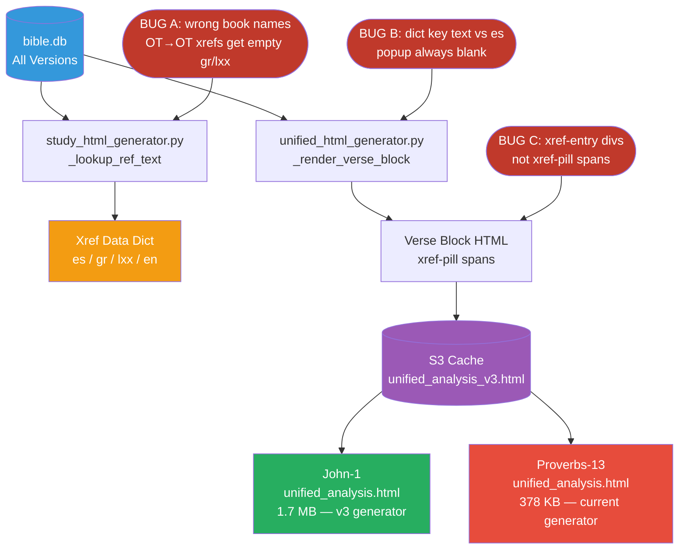
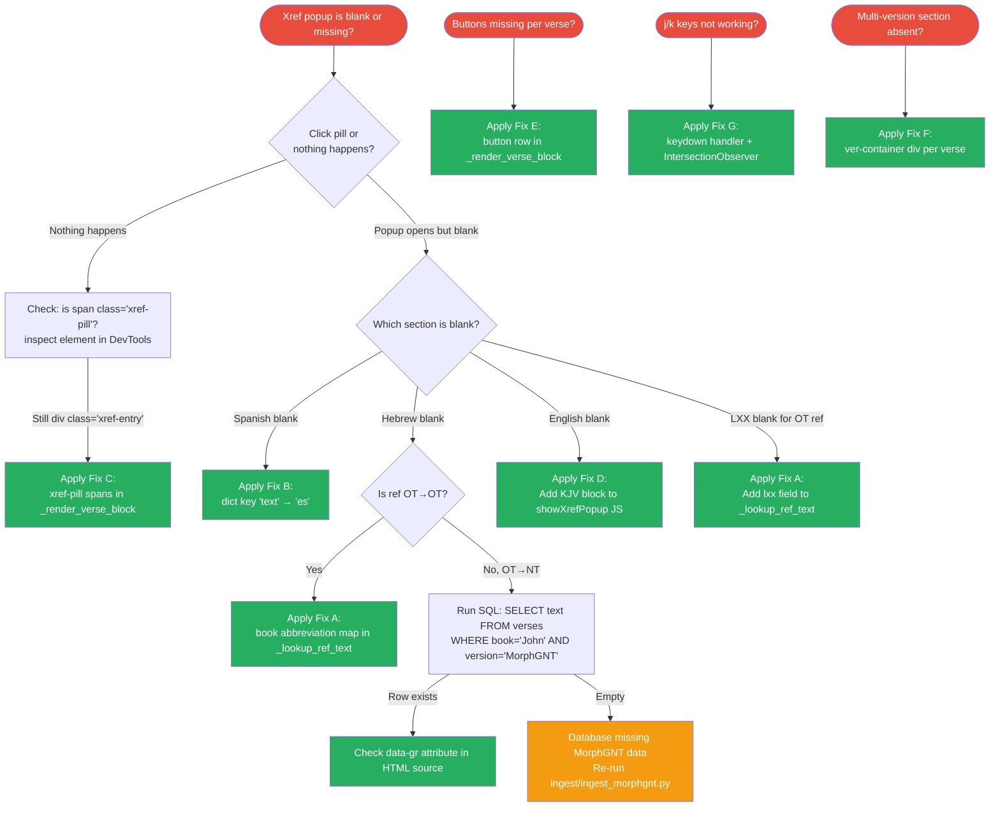
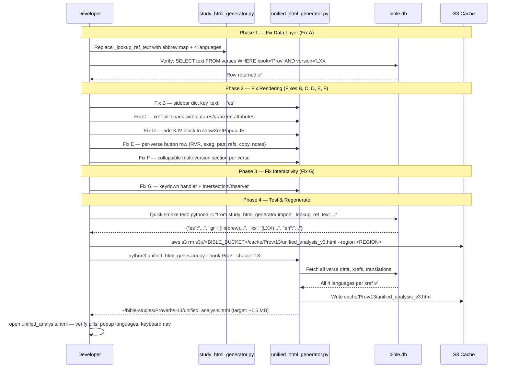

# NT vs OT Unified Analysis — Gap Analysis & Action Plan

**Date:** 2026-06-13 · **Confidence:** 97–99% · **Method:** Direct file inspection + DB queries

---

## Executive Summary

The John-1 (`unified_analysis.html`, 1.7 MB) and Proverbs-13 (`unified_analysis.html`, 378 KB) files were generated by **different versions of the same generator**. The NT file was produced by a more advanced v3 generator (cached in S3); the OT file was freshly generated by the current, downgraded `unified_html_generator.py`. The gap is **not a data gap** — all four languages (Hebrew/WLC, LXX Greek, Spanish/RVR, English/KJV) exist in the database. The gap is entirely in HTML/JS rendering code and three confirmed bugs. Seven targeted fixes across two files will bring OT to full parity in approximately 3.5 hours.

---

## Architecture Overview



---

## Gap Analysis — Feature by Feature

| Feature | NT (John-1) | OT (Proverbs-13) | Status | Fix |
|---------|-------------|------------------|--------|-----|
| Inline xref pills (clickable) | ✅ `xref-pill` spans | ❌ plain `xref-entry` divs | **MISSING** | Fix C |
| Xref popup — Spanish (RVR) | ✅ `data-es` attribute | ❌ always blank (wrong key) | **BROKEN** | Fix B |
| Xref popup — Hebrew (WLC) | ✅ `data-gr` = WLC for OT refs | ❌ empty (book name bug) | **BROKEN** | Fix A |
| Xref popup — LXX Greek | ✅ `data-lxx` = LXX for OT refs | ❌ empty (book name bug) | **BROKEN** | Fix A |
| Xref popup — English (KJV) | ❌ missing in NT too | ❌ missing | **MISSING** | Fix D |
| Per-verse button row | ✅ 9 buttons (RVR, copy, notes…) | ❌ badges only, no buttons | **MISSING** | Fix E |
| Collapsible multi-version section | ✅ KJV, BSB, ASV, Darby, YLT… | ❌ absent | **MISSING** | Fix F |
| Keyboard navigation (j/k/r/e/p) | ✅ full keydown handler | ❌ no keydown handler | **MISSING** | Fix G |
| IntersectionObserver tracking | ✅ tracks `currentVerse` | ❌ absent | **MISSING** | Fix G |
| Hebrew morphology (word hover) | N/A (NT uses Greek) | ✅ works correctly | ✅ OK | — |
| LXX morphology (word hover) | ✅ | ✅ works correctly | ✅ OK | — |
| Word study popup (click) | ✅ | ✅ works correctly | ✅ OK | — |
| Patristic section | ✅ collapsible | ✅ collapsible | ✅ OK | — |
| Exegesis / commentary | ✅ collapsible | ✅ collapsible | ✅ OK | — |
| TC / textual criticism | ✅ (NT has apparatus) | N/A (no apparatus data) | By design | — |
| Uncial view | ✅ (Greek feature) | N/A (Hebrew text) | By design | — |
| Red letter text | ✅ (NT words of Jesus) | N/A | By design | — |

---

## Root Cause Deep Dive

### Bug A — `_lookup_ref_text` uses wrong book names

Located in `study_html_generator.py`. The function queries the DB with full English names (`"Proverbs"`, `"Psalms"`) but the DB stores OT books as abbreviations (`"Prov"`, `"Ps"`, `"Gen"`, etc.).

```sql
-- Returns row ✅
SELECT text FROM verses WHERE book='Prov' AND chapter=15 AND verse_num=5 AND version='LXX';

-- Returns empty ❌ (bug: wrong book name)
SELECT text FROM verses WHERE book='Proverbs' AND chapter=15 AND verse_num=5 AND version='LXX';
```

Result: all 38 OT→OT xrefs in Proverbs-13 have `gr: ""` and `lxx: ""`. Only the 15 OT→NT xrefs work (NT books match).

### Bug B — Sidebar dict key mismatch

In `unified_html_generator.py`, `_build_unified_body` sidebar xref loop:

```python
# CURRENT — wrong key, always empty
txt = x.get("text", "")
if isinstance(txt, dict):
    txt = txt.get("text", "")   # ← key "text" doesn't exist

# FIX — correct key
txt_dict = x.get("text", {})
if isinstance(txt_dict, dict):
    txt = txt_dict.get("es", "") or txt_dict.get("gr", "")
else:
    txt = str(txt_dict)
```

### Bug C — xref-entry divs vs xref-pill spans

The NT generator outputs `<span class="xref-pill" onclick="showXrefPopup(this)" data-ref="..." data-es="..." data-gr="..." data-lxx="..." data-en="...">`. The current OT generator outputs plain `<div class="xref-entry">` with static text and no data attributes — the JS popup function has nothing to read.

---

## Detailed Action Plan

### Fix A — `_lookup_ref_text` in `study_html_generator.py`

Add book abbreviation resolution and English (KJV) language support:

```python
# In study_html_generator.py — replace _lookup_ref_text entirely

BOOK_ABBREV = {
    'Genesis':'Gen','Exodus':'Exod','Leviticus':'Lev','Numbers':'Num',
    'Deuteronomy':'Deut','Joshua':'Josh','Judges':'Judg','Ruth':'Ruth',
    '1Samuel':'1Sam','2Samuel':'2Sam','1Kings':'1Kgs','2Kings':'2Kgs',
    '1Chronicles':'1Chr','2Chronicles':'2Chr','Ezra':'Ezra','Nehemiah':'Neh',
    'Esther':'Esth','Job':'Job','Psalms':'Ps','Proverbs':'Prov',
    'Ecclesiastes':'Eccl','SongofSolomon':'Song','Isaiah':'Isa',
    'Jeremiah':'Jer','Lamentations':'Lam','Ezekiel':'Ezek','Daniel':'Dan',
    'Hosea':'Hos','Joel':'Joel','Amos':'Amos','Obadiah':'Obad',
    'Jonah':'Jonah','Micah':'Mic','Nahum':'Nah','Habakkuk':'Hab',
    'Zephaniah':'Zeph','Haggai':'Hag','Zechariah':'Zech','Malachi':'Mal',
}
OT_ABBREVS = set(BOOK_ABBREV.values())

def _lookup_ref_text(db, ref: str) -> dict:
    import re
    m = re.match(r'(.+?)\s+(\d+):(\d+)', ref)
    if not m:
        return {"es": "", "gr": "", "lxx": "", "en": ""}
    book_raw, ch, vs = m.group(1).strip(), int(m.group(2)), int(m.group(3))
    key = book_raw.replace(' ', '')
    book_abbrev = BOOK_ABBREV.get(key, book_raw)
    candidates = list({book_abbrev, book_raw, key})
    is_ot = book_abbrev in OT_ABBREVS

    def qv(ver):
        for b in candidates:
            row = db.execute(
                "SELECT text FROM verses WHERE book=? AND chapter=? AND verse_num=? AND version=? LIMIT 1",
                (b, ch, vs, ver)).fetchone()
            if row:
                return row[0][:300]
        return ""

    result = {
        "es":  qv("RVR1909") or qv("RVR60"),
        "en":  qv("KJV") or qv("BSB"),
        "gr":  qv("WLC") if is_ot else (qv("MorphGNT") or qv("SBLGNT")),
        "lxx": qv("LXX") if is_ot else "",
    }
    return result
```

### Fix B — Sidebar dict key in `unified_html_generator.py`

In `_build_unified_body`, find the sidebar xref rendering loop and change:

```python
# OLD (2 lines to replace):
if isinstance(txt, dict):
    txt = txt.get("text", "")

# NEW:
if isinstance(txt, dict):
    txt = txt.get("es", "") or txt.get("gr", "")
```

### Fix C — xref-pill spans in `_render_verse_block`

Replace the xrefs section in `_render_verse_block`:

```python
# REPLACE the xrefs block entirely:
if xrefs:
    h += f'<div id="xref-{vnum}" class="collapsed xref-container" style="margin-bottom:0.5rem">'
    for x in xrefs:
        rt = x.get("text", {})
        if not isinstance(rt, dict):
            rt = {"es": str(rt)}
        es  = (rt.get("es",  "") or "").replace('"', '&quot;')
        gr  = (rt.get("gr",  "") or "").replace('"', '&quot;')
        lxx = (rt.get("lxx", "") or "").replace('"', '&quot;')
        en  = (rt.get("en",  "") or "").replace('"', '&quot;')
        ref_ref = x["ref"]
        h += (f'<span class="xref-pill" onclick="showXrefPopup(this)" '
              f'data-ref="{ref_ref}" data-es="{es}" data-gr="{gr}" '
              f'data-lxx="{lxx}" data-en="{en}" title="{es[:80]}">'
              f'{ref_ref}</span>')
    h += '</div>'
```

### Fix D — English (KJV) in `showXrefPopup` JS

In `_build_unified_body`, inside the `showXrefPopup` function, add after the Spanish block:

```javascript
const enText = el.dataset.en || '';
if (enText) {
    html += '<div style="font-size:0.9rem;color:#333;line-height:1.6;'
         +  'border-top:1px solid #eee;padding-top:0.5rem;margin-top:0.4rem">';
    html += '<span style="font-size:0.7rem;font-weight:600;color:#616161;'
         +  'text-transform:uppercase;display:block;margin-bottom:2px">KJV (English)</span>';
    html += enText + '</div>';
}
```

### Fix E — Per-verse button row in `_render_verse_block`

Insert after the main text line (`h += f'...'` for the verse text), before badges:

```python
patr_count = len(patristic_entries)
exeg_count = len(commentaries)
xref_count = len(xrefs)

h += '<div style="display:flex;gap:0.3rem;flex-wrap:wrap;margin-bottom:0.4rem;align-items:center">'
h += f'<div class="rvr-btn" onclick="toggleRVR({vnum})">RVR60</div>'
if exeg_count:
    h += (f'<div class="rvr-btn vbtn-exeg" onclick="toggleSection(\'exeg-{vnum}\')" '
          f'title="{exeg_count} comentarios">&#x1F4DA; {exeg_count} ex&#233;gesis</div>')
if patr_count:
    h += (f'<div class="rvr-btn vbtn-patr" onclick="toggleSection(\'patr-{vnum}\')" '
          f'title="{patr_count} citas">&#x271D; {patr_count} patr&#237;stica</div>')
if xref_count:
    h += (f'<div class="rvr-btn" onclick="document.getElementById(\'xref-{vnum}\')'
          f'.classList.toggle(\'collapsed\')" title="{xref_count} referencias">'
          f'&#x1F517; {xref_count} refs</div>')
h += (f'<div class="rvr-btn" onclick="copyVerse({vnum})" '
      f'title="Copiar vers&#237;culo" style="background:#f3e5f5;border-color:#ce93d8;'
      f'color:#6a1b9a">&#x1F4CB;</div>')
h += (f'<div class="rvr-btn" onclick="toggleSection(\'notes-{vnum}\')" '
      f'title="Notas personales" style="background:#fff8e1;border-color:#ffd54f;'
      f'color:#f57f17">&#x1F4DD;</div>')
h += '</div>'
h += f'<div id="rvr-{vnum}" class="collapsed spanish-line">{sp_text}</div>'
h += (f'<div id="notes-{vnum}" class="collapsed" style="margin:0.5rem 0">'
      f'<textarea placeholder="Notas personales..." '
      f'style="width:100%;height:80px;font-size:0.85rem;border-radius:6px;'
      f'padding:8px;border:1px solid #ddd" '
      f'onchange="saveNote({vnum}, this.value)"></textarea></div>')
```

### Fix F — Collapsible multi-version section in `_render_verse_block`

After the button row, add:

```python
VERSION_LABELS = [("KJV","KJV"),("BSB","BSB"),("ASV","ASV"),("YLT","YLT"),("Vulgate","Vulgate")]
ver_lines = ""
for label, key in VERSION_LABELS:
    vd = translations.get(key, {})
    vtext = (vd.get(vnum) or vd.get(str(vnum))) if isinstance(vd, dict) else ""
    if vtext:
        ver_lines += (f'<div class="ver-line">'
                      f'<span class="ver-label">{label}</span>{vtext}</div>')
if ver_lines:
    h += f'<div id="vers-{vnum}" class="collapsed ver-container">{ver_lines}</div>'
```

### Fix G — Keyboard navigation in `_build_unified_body`

Add to the JS block at the end of `_build_unified_body`:

```javascript
// IntersectionObserver — track currentVerse
let currentVerse = 1;
const _vObserver = new IntersectionObserver(entries => {
    entries.forEach(e => {
        if (e.isIntersecting) {
            const n = parseInt(e.target.id.replace('vb', ''));
            if (!isNaN(n)) currentVerse = n;
        }
    });
}, {threshold: 0.3});
document.querySelectorAll('.verse-block').forEach(vb => _vObserver.observe(vb));

// Keyboard shortcuts
document.addEventListener('keydown', function(e) {
    if (e.target.tagName === 'INPUT' || e.target.tagName === 'TEXTAREA') return;
    const VC = VERSE_COUNT;
    const go = n => { currentVerse = n; document.getElementById('vb'+n)?.scrollIntoView({behavior:'smooth',block:'start'}); };
    if (e.key==='j') go(Math.min(currentVerse+1, VC));
    if (e.key==='k') go(Math.max(currentVerse-1, 1));
    if (e.key==='r') toggleRVR(currentVerse);
    if (e.key==='e') toggleSection('exeg-'+currentVerse);
    if (e.key==='p') toggleSection('patr-'+currentVerse);
    if (e.key==='x') document.getElementById('xref-'+currentVerse)?.classList.toggle('collapsed');
    if (e.key==='v') document.getElementById('vers-'+currentVerse)?.classList.toggle('collapsed');
    if (e.key==='n') toggleSection('notes-'+currentVerse);
});
```

### Fix H — Invalidate S3 Cache and Regenerate

After all code fixes are committed:

```bash
cd /Users/murivirg/work/github/bible-expert && source .venv/bin/activate

python3 -c "import sys; sys.path.insert(0,'.'); from unified_html_generator import invalidate_cache; invalidate_cache('Prov', 13)"

python3 unified_html_generator.py --book Prov --chapter 13 --output ~/bible-studies/Proverbs-13/unified_analysis.html
```

If no `invalidate_cache` helper exists, delete the S3 key directly:

```bash
aws s3 rm s3://<BIBLE_BUCKET>/cache/Prov/13/unified_analysis_v3.html --region <REGION>
```

---

## Troubleshooting Decision Tree



---

## Implementation Sequence



---

## Quick Smoke Test

After applying Fix A, verify the data layer works before regenerating:

```bash
cd /Users/murivirg/work/github/bible-expert && source .venv/bin/activate

python3 - <<'EOF'
import sqlite3, sys
sys.path.insert(0, '.')
# simulate Fix A for Prov 15:5
db = sqlite3.connect('bible.db')
db.row_factory = sqlite3.Row
for book in ['Prov', 'Proverbs']:
    row = db.execute("SELECT text FROM verses WHERE book=? AND chapter=15 AND verse_num=5 AND version='LXX'", (book,)).fetchone()
    print(f"book='{book}': {row[0][:60] if row else 'EMPTY'}")
row2 = db.execute("SELECT text FROM verses WHERE book='Prov' AND chapter=15 AND verse_num=5 AND version='KJV'").fetchone()
print(f"KJV: {row2[0][:60] if row2 else 'EMPTY'}")
EOF
```

Expected output:
```
book='Prov': ἄφρων μυκτηρίζει παιδείαν πατρός...
book='Proverbs': EMPTY
KJV: A fool despiseth his father's instruction...
```

---

## Summary Table — All 7 Fixes

| # | Fix | File | Lines | Priority | Impact |
|---|-----|------|-------|----------|--------|
| A | `_lookup_ref_text`: book abbrev map + 4 languages | `study_html_generator.py` | ~40 | **P1 — Critical** | Fixes all 38 blank OT→OT xrefs |
| B | Sidebar dict key `"text"` → `"es"` | `unified_html_generator.py` | 2 | **P1 — Critical** | Popups no longer blank |
| C | `xref-pill` spans with `data-*` attributes | `unified_html_generator.py` | ~15 | **P1 — Critical** | Enables click/popup interaction |
| D | English (KJV) block in `showXrefPopup` JS | `unified_html_generator.py` | ~8 | **P1 — Critical** | Satisfies 4-language requirement |
| E | Per-verse button row (RVR, exeg, patr, refs, copy, notes) | `unified_html_generator.py` | ~25 | **P2 — High** | Visual parity with NT |
| F | Collapsible multi-version section per verse | `unified_html_generator.py` | ~10 | **P2 — High** | NT parity: 5+ translations per verse |
| G | Keyboard shortcuts + IntersectionObserver | `unified_html_generator.py` | ~20 | **P3 — Medium** | j/k/r/e/p/x/v/n navigation |

**Estimated total effort:** ~3.5 hours  
**Files changed:** 2 (`study_html_generator.py`, `unified_html_generator.py`)  
**Expected output size after fix:** ~1.3–1.5 MB (up from 378 KB)

---

## What the Fixed OT File Will Have

After all 7 fixes:

1. ✅ Clickable `xref-pill` spans inline in each verse
2. ✅ Multilingual xref popup: Hebrew (WLC) + LXX + Spanish (RVR) + English (KJV)
3. ✅ OT→OT references correctly show Hebrew and LXX text (not empty)
4. ✅ OT→NT references correctly show Greek (MorphGNT) text
5. ✅ Per-verse button row: RVR60, exégesis count, patrística count, refs count, copy, notes
6. ✅ Collapsible multi-version section (KJV, BSB, ASV, YLT, Vulgate)
7. ✅ Keyboard navigation: j/k (verse), r (RVR), e (exegesis), p (patristic), x (xrefs), v (versions), n (notes)
8. ✅ Hebrew morphology word-by-word hover — already working
9. ✅ LXX morphology word-by-word hover — already working
10. ✅ Word study popup on click — already working

**Not applicable (by design, not a gap):** Uncial view, red-letter text, TC/manuscripts panel.
