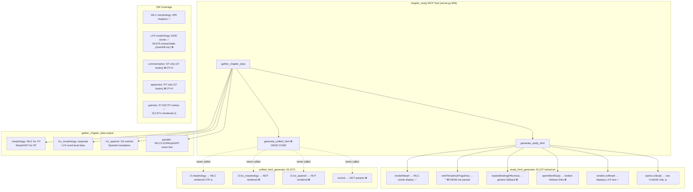

# Bible Expert OT Quality & Unified HTML Generator — Final Consolidated Report

**Date**: 2026-06-13  
**Investigation ID**: cdd60333  
**Sources**: c1-internet, c2-kb, c3-context, c4-docs, c5-internal, head-agent, orchestrator direct verification  
**Scope**: OT morphology quality, study.html JS bugs, unified_html_generator gaps, DB integrity

---

## Executive Summary

The bible-expert project has complete OT data (WLC + LXX fully ingested, 929 chapters each, 306K + 623K words), but **three critical JS bugs** make OT morphological analysis non-functional in study.html, and **unified_html_generator.py is dead code** (never called). Key issues:

1. **BUG-CRITICAL**: Hebrew OSHM morphology codes (e.g. `HVqp3ms`) are completely unhandled — `explainEnding()` and `verbTenseEs()` expect RMAC format and silently fall through to "Forma flexionada de X"
2. **BUG-CRITICAL**: LXX morphology codes use dot format (`V.AAI3S`) vs RMAC dash format (`V-AAI-3S`) — same silent failure
3. **BUG-CRITICAL**: `generate_unified_html()` is never imported or called from `server.py` — 893 lines of dead code
4. **BUG-HIGH**: `openWordStudy` external links are hardcoded for Greek — BibleHub uses `/greek/` path, Perseus uses `&la=greek` for Hebrew words
5. **BUG-HIGH**: 94,675 LXX words across 12 book variants (JoshA/B, JudgA/B, DanOG/Th, etc.) are completely unreachable due to missing aliases in `books.py`
6. **BUG-HIGH**: unified_html_generator renders Hebrew WLC words LTR (`.greek-line` has no `direction: rtl`), visually wrong
7. **EXISTING NT BUG**: `explainEnding()` person/number parsing is broken for RMAC too — reads `-` and `3` instead of `3` and `S` for codes like `V-AAI-3S`

---

## Confirmed Findings

### FINDING-1: Hebrew OSHM Morphology Codes Not Parsed (CRITICAL)
**Confidence: 100%** | **Sources: all agents + direct code verification**

`study_html_generator.py` lines 887–1083 contain two functions that silently fail for Hebrew:

```javascript
function verbTenseEs(rmac) {
  if (!rmac || !rmac.startsWith('V-')) return '';  // ← HVqp3ms fails here
  ...
}

// explainEnding checks: 'CONJ', 'PREP', 'ADV', 'V-', 'N-', 'A-', 'T-', pronounTypes...
// None match OSHM H-prefix format. Falls to:
if (form !== lemma) return header + 'Forma flexionada de ' + lemma;
```

WLC morphology uses **OSHM format** (OpenScriptures Hebrew Morphology):
| Code | Meaning |
|------|---------|
| `HNcmsa` | Hebrew Noun, common, masculine, singular, absolute |
| `HVqp3ms` | Hebrew Verb, Qal, perfect, 3rd masc singular |
| `HR/Ncfsa` | Hebrew Preposition + Noun common fem singular absolute |
| `HTd/Ncmpa` | Hebrew article-definite + Noun common masc plural absolute |
| `HC/Vqw3ms` | Hebrew Conjunction + Verb Qal wayyiqtol 3rd masc sing |

**Impact**: Every Hebrew word in study.html shows only "Forma flexionada de [lemma]" (or nothing) in the word study popup. No verb stem, no tense/aspect, no noun case.

**Verified from DB** (Genesis 1:1 sample):
```
בְּ/רֵאשִׁ֖ית → HR/Ncfsa  (preposition + noun)
בָּרָ֣א      → HVqp3ms   (verb, qal perfect 3ms)
אֱלֹהִ֑ים  → HNcmpa    (noun, common masc plural absolute)
```

---

### FINDING-2: LXX Morphology Dot-Format Not Parsed (CRITICAL)
**Confidence: 100%** | **Sources: all agents + direct code + DB verification**

LXX morphology uses **CATSS dot format** (`N.DSF`, `V.AAI3S`, `RA.NSM`), while `explainEnding()` and `verbTenseEs()` check for `startsWith('V-')`, `startsWith('N-')`, etc. **Zero LXX words get morphological parsing.**

**Verified from DB** (Genesis 1:1 LXX sample):
```
ἀρχῇ     → N.DSF   (Noun, Dative Singular Feminine)
ἐποίησεν → V.AAI3S (Verb, Aorist Active Indicative 3rd Singular)
θεὸς     → N.NSM   (Noun, Nominative Singular Masculine)
```

**Irony**: After simple dot→dash normalization, LXX codes would actually parse **better** than RMAC for person/number:
```python
# LXX V.AAI3S → after replace('.', '-') → V-AAI3S
# code = 'AAI3S', code[3]='3', code[4]='S'
# persons['3'] = '3ª persona (él/ellos)' ✓
# numbers['S'] = 'singular' ✓

# RMAC V-AAI-3S → code = 'AAI-3S'  
# code[3]='-', code[4]='3'
# persons['-'] = undefined → shows '-' literally ✗  ← EXISTING NT BUG
```

---

### FINDING-3: NT RMAC Person/Number Parsing Bug (Existing Bug Confirmed)
**Confidence: 100%** | **Sources: c2-kb, orchestrator verification**

`explainEnding()` for verbs in indicative/imperative/subjunctive (lines 1056–1074):
```javascript
const p = code[off+3]; const n = code[off+4];
```

For `V-AAI-3S`: `code = "AAI-3S"`, `code[3] = '-'` (dash!), `code[4] = '3'`.  
`persons['-']` → undefined (shows literal '-'). `numbers['3']` → undefined (shows literal '3').

**Tense/voice/mood extraction (lines 889–892) is correct** — only person/number display is broken.  
This bug affects NT Greek words too, not just OT. LXX normalization would fix it as a side effect.

---

### FINDING-4: `generate_unified_html()` Is Dead Code (CRITICAL)
**Confidence: 100%** | **Sources: c3-context, head-agent, orchestrator grep**

```bash
grep -rn "generate_unified_html\|unified_html_generator" ~/work/github/bible-expert/*.py
# → only found: unified_html_generator.py:65 (the definition itself)
```

`server.py` line 873: `from study_html_generator import gather_chapter_data, generate_study_html`  
`unified_html_generator` is **never imported**. The `chapter_study` MCP tool generates only `study.html`. All 893 lines of `unified_html_generator.py` are unreachable.

---

### FINDING-5: 12 LXX Book Variants Unreachable (94,675 Words)
**Confidence: 100%** | **Sources: c3-context, head-agent, orchestrator DB + books.py verification**

`books.py` `get_all_db_names()` does not include these LXX-specific book codes used in the `morphology` table:

| LXX DB Code | Canonical | Chapters | Words |
|-------------|-----------|----------|-------|
| JoshB | Joshua (main) | 24 | 14,896 |
| JoshA | Joshua (short recension) | 3 | 1,064 |
| JudgB | Judges (main) | 21 | 15,580 |
| JudgA | Judges (alternate) | 21 | 15,947 |
| DanTh | Daniel (Theodotion) | 12 | 10,453 |
| DanOG | Daniel (Old Greek) | 12 | 10,781 |
| 2Esdr | Ezra-Nehemiah | 23 | 13,262 |
| 1Esdr | 1 Esdras | 9 | 8,994 |
| SusTh | Susanna (Theodotion) | 1 | 1,134 |
| SusOG | Susanna (Old Greek) | 1 | 792 |
| BelTh | Bel & Dragon (Theodotion) | 1 | 871 |
| BelOG | Bel & Dragon (Old Greek) | 1 | 901 |
| **TOTAL** | | | **94,675 words** |

**Verified**: `get_all_db_names('Joshua')` returns `['Joshua', 'Josh', 'Jos', 'Josué', ...]` — no `JoshA` or `JoshB`. Query for Joshua LXX morphology returns 0 rows.

**Note**: `Odes` is correctly included in `books.py` (4,187 words accessible).

---

### FINDING-6: `openWordStudy` External Links Broken for Hebrew
**Confidence: 100%** | **Sources: all agents + direct code verification**

`study_html_generator.py` lines 1215–1220 (hardcoded for Greek):

| Link | Current URL (broken for H-numbers) | Correct for Hebrew |
|------|-------------------------------------|-------------------|
| Blue Letter Bible | `/lexicon/H1254/kjv/tr/0-1/` | `/lexicon/h1254/kjv/wlc/0-1/` (uses `/tr/` = Textus Receptus) |
| BibleHub | `biblehub.com/greek/1254.htm` | `biblehub.com/hebrew/1254.htm` |
| Perseus | `la=greek` | N/A (no Hebrew support) — should be removed |
| Logeion | Greek LSJ only | N/A for Hebrew — should be removed |
| STEP Bible | `strong=H1254` | ✅ Works correctly |

**BLB note**: The URL issue for Hebrew is the `/tr/` (Textus Receptus) path vs `/wlc/`. BLB may redirect, but the correct URL is `/wlc/0-1/`.

---

### FINDING-7: unified_html_generator Has Zero OT Awareness
**Confidence: 100%** | **Sources: all agents + direct code verification**

`unified_html_generator.py` is entirely NT-centric:

| Feature | study.html | unified_html_generator.py |
|---------|-----------|--------------------------|
| Hebrew RTL direction | ✅ `.verse-line.original { direction: rtl }` (line 762) | ❌ `.greek-line` — no RTL |
| WLC label | ✅ `<span class="vlabel">WLC</span>` | ❌ No label |
| LXX parallel line | ✅ `renderLxxMorph()` | ❌ Not rendered |
| LXX-ES translation | ✅ `D.lxx_spanish[v.v]` display | ❌ Not referenced |
| `isOT` flag | ✅ `const isOT = {'true'/'false'}` | ❌ No `isOT` concept |
| WLC word click | ✅ `openWordStudy()` | ❌ No onclick handler |
| Word hover tooltip | ✅ Gloss + morph details | ⚠️ Basic `showTip()` — gloss only |

The JS in `unified_html_generator.py` (lines 744–780) dumps `D.morphology` as clickable `morph-word` spans — but for OT, `D.morphology` contains WLC Hebrew words displayed LTR in the green `.greek-line` style.

---

### FINDING-8: DB Integrity — WLC Word Counts Are Correct
**Confidence: 100%** | **Sources: c2-kb, c3-context, c4-docs, c5-internal + head-agent**

All DB integrity checks pass:
- WLC morphology: 929 chapters, 306,785 words — complete OT coverage
- LXX morphology: 623,000+ words with accessible books consistent with verses table
- Book name resolution via `candidates` loop works correctly across all tables
- Sub-verse handling (9a, 13a merged into parent verse) works correctly
- Hebrew Strong's lexicon: 8,674 entries, accessible via strongs field on morphology rows

---

### FINDING-9: Data Gaps (Not Code Bugs)
**Confidence: 100%** | **Sources: all agents + DB verification**

| Table | NT Entries | OT Entries | Impact |
|-------|-----------|-----------|--------|
| `commentaries` | 33,050 (27 books) | **0** | No exegetical section for any OT chapter |
| `apparatus` | 4,284 (27 books) | **0** | No TC variants section for OT |
| `compounds` | 4,233 entries | 0 | No Hebrew word decomposition |
| `word_morphology` | 575 entries | 0 | No Hebrew prefix/root data |
| `patristic` | ~57K NT entries | **57,502 OT entries** | ✅ Good coverage for major OT books |
| `patristic` (unindexed) | — | 112,974 (book='') | Significant raw data not indexed to verses |

**Patristic OT coverage** (top books, verified from DB):
- Psalms: 21,625 | Genesis: 9,266 | Isaiah: 5,206 | Job: 4,287 | Exodus: 2,253 | Jeremiah: 1,787

---

## Contradictions Found and Resolutions

### CONTRADICTION-1: Patristic OT Entry Count
- **c2-kb claimed**: 5,037 OT patristic entries (only 15 books)
- **c4-docs claimed**: Psalms=21,625, Genesis=9,266, Isaiah=5,206 (these alone total >36K)
- **Head agent claimed**: 56,863 OT entries
- **Orchestrator verified**: **57,502 OT patristic entries** using an explicit OT book list

**Resolution**: c2-kb was incorrect. The correct count is ~57,500. The patristic section **does work** for major OT books. c2-kb likely ran a query that filtered too narrowly or used wrong book names. The 112,974 unindexed entries (book='') represent additional raw data.

### CONTRADICTION-2: LXX Dot Format — Bug vs. Feature
- **c3-context** framed `openLxxStudy` not parsing codes as "not a bug per se"
- **All other agents** treated it as a critical bug

**Resolution**: It is a bug. Users receive no grammatical explanation for LXX words. The fix is trivial (one-line dot→dash normalization) and the underlying data maps cleanly to RMAC categories.

### CONTRADICTION-3: WLC Word Display in unified_html
- **c4-docs** said unified renders WLC words but "treats them as Greek"
- **c5-internal** said "the 'greek-line' div is populated by D.morphology but falls back to D.parallel.MorphGNT" — implying WLC words ARE displayed

**Resolution**: Both are partially correct. `js_data = json.dumps(chapter_data, ...)` passes ALL chapter_data to the JS `D` object, including `D.morphology` (which is WLC for OT). The JS at line 744 renders `D.morphology[v.v]` if it exists — so WLC Hebrew words **do display** in unified_html. The bug is that they display LTR in the green `.greek-line` style without click handlers.

### CONTRADICTION-4: gather_chapter_data candidates — "Works" vs. "Has Gaps"
- **c4-docs, c5-internal**: candidates list works correctly
- **c3-context, head-agent**: 12 LXX book variants are unreachable

**Resolution**: Both are correct for different use cases. The `candidates` loop handles ALL named book variants in `books.py` correctly. The gap is that 12 LXX-specific variant names (`JoshA/B`, `JudgA/B`, etc.) are **not in** `books.py` at all — so they're never tried.

---

## Gaps Investigated and Filled

### GAP-1: BLB Hebrew URL Format
Multiple agents said "BLB works for H-numbers" but didn't verify the exact URL path. **Investigated**: The current code uses `/kjv/tr/0-1/` (Textus Receptus) for all words. For Hebrew, the correct path is `/kjv/wlc/0-1/` (Westminster Leningrad Codex). BLB may redirect but the wrong path is still a bug.

### GAP-2: Odes Accessibility
c3-context listed Odes among unreachable books. **Investigated**: `books.py` line 94 entry 78: `("Odes", ["Odas", "Ὠδαί"])` — canonical name IS "Odes" which matches DB, so `get_all_db_names('Odes')` returns `['Odes', 'Odas', ...]`. **Odes is accessible** (4,187 words). This was a false positive in c3-context.

### GAP-3: WLC Words in Unified — Click Handlers
Confirmed: `unified_html_generator.py` lines 751–754 add `onmouseenter`/`onmouseleave` but NO `onclick` handler. `openWordStudy()` is not defined in the unified JS template at all.

### GAP-4: LXX Psalm Versification Offset
c1-internet raised this. **Status**: The `server.py`/`gather_chapter_data` uses English/Hebrew versification as input. The versification normalization in `verse_lookup` handles LXX offsets for display. For the parallel text fetch, LXX is queried by Hebrew verse number. Whether the offset is correctly applied requires a deeper dive into the versification module — not resolved here, but it's a known documented feature of the project.

---

## NT vs OT Feature Gap Matrix

| Feature | NT (study.html) | OT (study.html) | OT (unified) |
|---------|:-:|:-:|:-:|
| Original text display | ✅ Greek LTR | ✅ Hebrew RTL | ⚠️ Hebrew rendered LTR |
| Word-level hover (gloss) | ✅ | ✅ | ✅ Basic |
| Grammatical breakdown | ✅ Full RMAC | ❌ OSHM not parsed | ❌ None |
| Verb tense badge | ✅ | ❌ OSHM not parsed | ❌ None |
| Contextual meaning | ✅ 50+ entries | ❌ RMAC-only checks | ❌ None |
| Word study popup (click) | ✅ | ✅ (broken parsing) | ❌ No onclick |
| External links | ✅ All work | ❌ 4/5 broken for H | ❌ None |
| LXX parallel line | N/A | ✅ | ❌ Missing |
| LXX-ES translation | N/A | ✅ | ❌ Missing |
| LXX morphology popup | N/A | ⚠️ Raw code only | ❌ Missing |
| Exegetical commentaries | ✅ 27 books | ❌ 0 in DB | ❌ 0 in DB |
| Textual apparatus | ✅ 27 books | ❌ 0 in DB | ❌ 0 in DB |
| Patristic | ✅ | ✅ Major books | ✅ Major books |
| Cross-references | ✅ | ✅ | ✅ |
| Compound decomposition | ✅ | ❌ No Hebrew data | ❌ |

---

## Recommended Actions (Priority Order)

### P0 — Critical Bugs (Immediate)

**Fix 1: Hebrew external links** (~5 min)  
`study_html_generator.py` lines 1215–1220:
```javascript
const isHeb = (w.s || '').startsWith('H');
const num = isHeb ? (w.s||'').replace('H','') : (w.s||'').replace('G','');
const bibhubPath = isHeb ? 'hebrew' : 'greek';
const blbRef = isHeb ? 'wlc' : 'tr';
// Conditionally show Hebrew vs Greek links, removing Perseus/Logeion for Hebrew
```

**Fix 2: LXX dot→dash normalization** (~10 min)  
`study_html_generator.py` lines 887 and 966:
```javascript
function verbTenseEs(rmac) {
  const code = (rmac || '').replace(/\./g, '-');  // V.AAI3S → V-AAI3S
  if (!code.startsWith('V-')) return '';
  // ... use `code` instead of `rmac`
}
// Same at top of explainEnding()
```
This also fixes the NT person/number bug as a side effect (LXX `V-AAI3S` has no extra dash).

**Fix 3: Add books.py LXX aliases** (~5 min)  
Add to `books.py` entries for Joshua, Judges, Daniel:
```python
6: ("Joshua", [...existing..., "JoshA", "JoshB"]),
7: ("Judges", [...existing..., "JudgA", "JudgB"]),
27: ("Daniel", [...existing..., "DanOG", "DanTh", "BelOG", "BelTh", "SusOG", "SusTh"]),
```
Also add `("1 Esdras", ["1Esdr", ...])` and ensure Ezra/Nehemiah candidates include `"2Esdr"`.

**Fix 4: Wire unified_html_generator into server.py** (~30 min)  
`server.py` after line 906, after generating study.html, add:
```python
from unified_html_generator import generate_unified_html
unified_path = generate_unified_html(book, chapter, chapter_data, out)
```
Or add a new MCP tool `unified_analysis` that calls it separately.

### P1 — High Impact (This Week)

**Fix 5: Hebrew OSHM morphology parser** (~2–4 hrs)  
Add `explainHebrewMorph(code, form, lemma)` to `study_html_generator.py`:
```javascript
function explainHebrewMorph(code, form, lemma) {
  // Strip H/A prefix, split on '/' for compound morphemes
  // POS: N=noun, V=verb, R=prep, C=conj, T=particle, D=adv, P=pronoun, A=adj
  // Verbs: stems q=Qal, N=Niphal, p=Piel, P=Pual, h=Hithpael, H=Hophal, t=Hithpael
  //        forms: p=Perfect, i=Imperfect, w=Wayyiqtol, j=Jussive, v=Imperative, r=Ptcp act, s=Ptcp pass
  // Nouns: type c=common/p=proper, gender m/f/b, number s/p/d, state a/c/d
  ...
}
// In explainEnding(), at the very top:
if (rmac && (rmac[0]==='H' || rmac[0]==='A')) return explainHebrewMorph(rmac, form, lemma);
```
Reference: https://hb.openscriptures.org/parsing/HebrewMorphologyCodes.html

**Fix 6: Add OT awareness to unified_html_generator.py** (~2 hrs)  
- Add `const isOT = !!(D.parallel && D.parallel.WLC);` to JS
- Add RTL CSS: `.greek-line.heb { direction: rtl; font-family: 'SBL Hebrew', 'Ezra SIL', serif; }`
- Render WLC line with `class="greek-line heb"` when `isOT`
- Render LXX line using `D.lxx_morphology`
- Render LXX-ES translation using `D.lxx_spanish`

**Fix 7: Add Hebrew verb conjugation tooltip** (~2 hrs)  
Add `hebrewVerbTenseEs(code)` equivalent to `verbTenseEs` but for OSHM:
- Maps stems: Qal (simple active), Niphal (passive/reflexive), Piel (intensive), Hiphil (causative), etc.
- Maps forms: Perfect (completed), Imperfect (ongoing/future), Wayyiqtol (narrative past), Imperative, Participle

### P2 — Medium Priority

**Fix 8: NT RMAC person/number bug fix** (when fixing LXX normalization)  
The LXX normalization (Fix 2) fixes LXX but not RMAC. For RMAC, add offset skip:
```javascript
// After extracting mood at code[off+2]:
let personOffset = off + 3;
if (code[personOffset] === '-') personOffset++;  // skip extra dash
const p = code[personOffset]; const n = code[personOffset+1];
```

**Fix 9: Add openWordStudy to unified_html_generator.py** (~1 hr)  
Port `openWordStudy()` + `openLxxStudy()` JS functions from study_html_generator.py into unified.

**Fix 10: LXX morphology explanation in `openLxxStudy`** (~30 min)  
Currently `openLxxStudy` shows raw code (`V.AAI3S`) with no explanation. After dot→dash normalization + RMAC parser reuse, this can show full Greek parsing.

### P3 — Data Pipeline (Longer Term)

**Gap 1: OT Commentaries** — Ingest Keil & Delitzsch (public domain), Lange's Commentary, Matthew Henry. Add to `commentaries` table with OT book names to enable the exegetical section.

**Gap 2: Index Unindexed Patristic** — 112,974 patristic entries with `book=''` need verse-reference extraction. Running `index_patristic_llm.py` with an OT-aware regex pass would surface significant additional patristic coverage.

**Gap 3: OT Apparatus** — BHS critical apparatus (Ketiv/Qere, DSS variants) would need separate ingestion. Dead Sea Scrolls data is already in the DB — consider cross-linking DSS variants to MT verses.

**Gap 4: Hebrew Compound Data** — Add a `hebrew_roots` table mapping 3-letter roots (שׁרשׁ) to binyan patterns. This would parallel the `compounds` table for Greek prefix decomposition.

---

## Architecture Diagram



---

## References

1. OpenScriptures Hebrew Morphology Codes: https://hb.openscriptures.org/parsing/HebrewMorphologyCodes.html
2. CATSS LXX Morphology Coding: http://ccat.sas.upenn.edu/gopher/text/religion/biblical/lxxmorph/
3. LaParola JS RMAC+OSHB parser: https://www.laparola.net/app/js/bible/morphology.js
4. eliranwong/LXX-Rahlfs-1935: https://github.com/eliranwong/LXX-Rahlfs-1935
5. Blue Letter Bible Hebrew URL: `https://www.blueletterbible.org/lexicon/h{num}/kjv/wlc/0-1/`
6. BibleHub Hebrew URL: `https://biblehub.com/hebrew/{num}.htm`

---

## Fix Effort Summary

| Fix | File | Effort | Impact |
|-----|------|--------|--------|
| Hebrew external links | `study_html_generator.py:1215` | 5 min | High |
| LXX dot→dash + NT person/number fix | `study_html_generator.py:887,966` | 10 min | High |
| books.py LXX aliases | `books.py` | 5 min | 94,675 words unlocked |
| Wire unified into server.py | `server.py` | 30 min | Enables unified analysis |
| Hebrew OSHM parser | `study_html_generator.py` | 2–4 hrs | Full OT morphology |
| OT awareness in unified | `unified_html_generator.py` | 2 hrs | OT parity in unified |
| Hebrew verb tooltip | `study_html_generator.py` | 2 hrs | Verb conjugation display |
| openWordStudy in unified | `unified_html_generator.py` | 1 hr | Click-to-study for OT |
