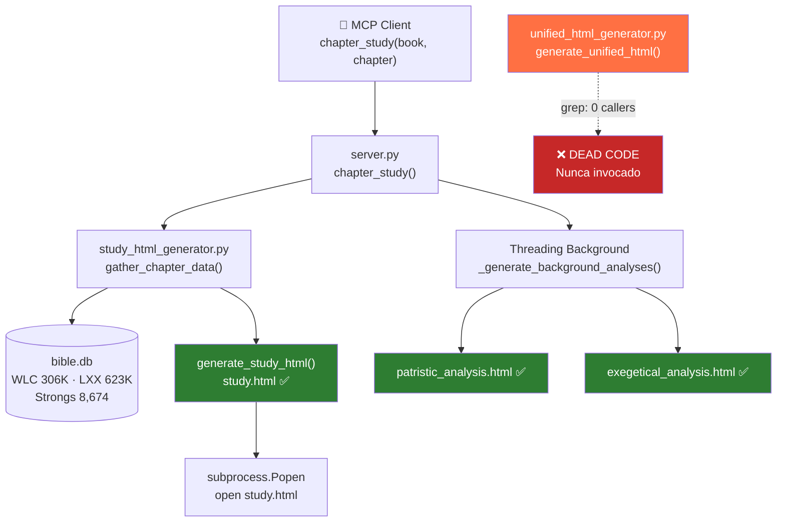
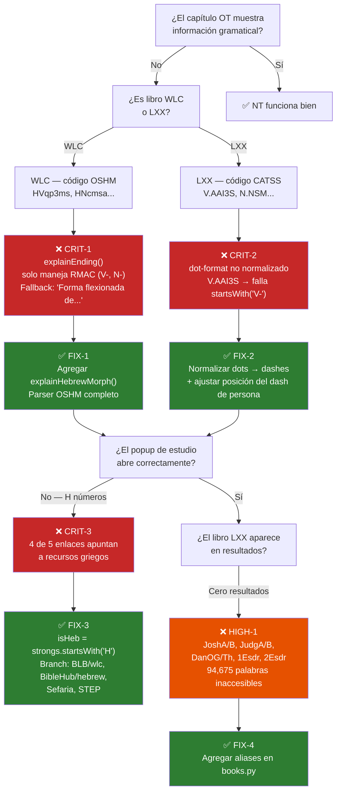
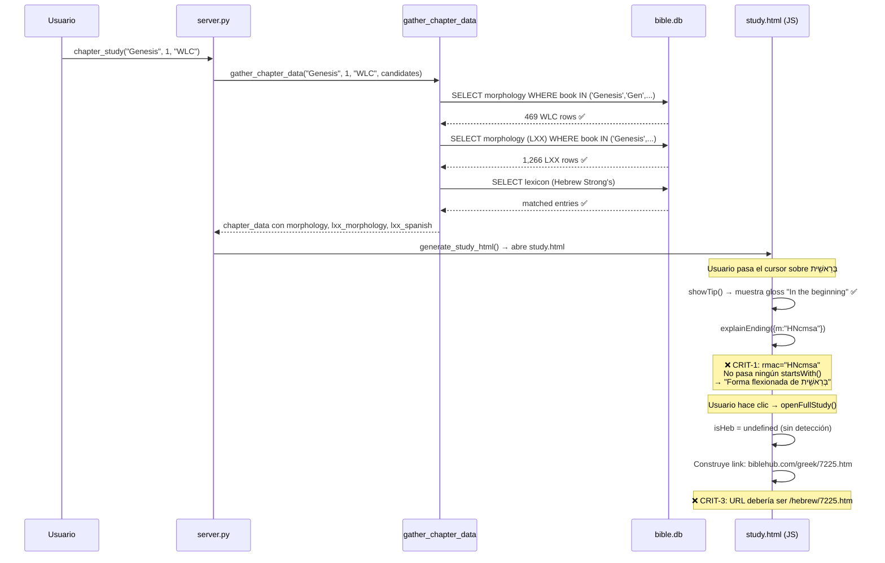

# Bible Expert — OT Quality & Unified HTML Generator
**Investigación**: cdd60333 · **Fecha**: 2026-06-13 · **Confianza**: Alta

---

## Resumen Ejecutivo

La ingesta de datos del AT fue exitosa: 306K palabras WLC (hebreo), 623K palabras LXX (griego), 8.674 entradas del léxico Strong's hebreo. `study_html_generator.py` carga y muestra estos datos correctamente con RTL y hover. Sin embargo, **4 bugs críticos** dejan al AT prácticamente sin información gramatical, con 5 enlaces rotos por palabra hebrea, y `unified_html_generator.py` es código muerto (nunca invocado desde `server.py`). Adicionalmente, 94.675 palabras de LXX son inaccesibles por aliases faltantes en `books.py`.

---

## Diagrama 1 — Arquitectura del Sistema y Flujo de Datos



---

## Diagrama 2 — Árbol de Decisión para Depuración OT



---

## Diagrama 3 — Secuencia: Lo Que Ocurre al Abrir Génesis 1



---

## Bug Inventory Completo

| ID | Sev | Archivo | Líneas | Descripción | Impacto |
|----|-----|---------|--------|-------------|---------|
| CRIT-1 | 🔴 Critical | study_html_generator.py | 887, 966 | OSHM codes no parseados — cero info gramatical hebreo | 306K palabras WLC sin gramática |
| CRIT-2 | 🔴 Critical | study_html_generator.py | 887, 966 | LXX dot-codes no normalizados a RMAC dashes | 623K palabras LXX sin gramática |
| CRIT-3 | 🔴 Critical | study_html_generator.py | 1215–1225 | 4/5 enlaces del popup apuntan a recursos griegos para H-numbers | Todos los estudios hebreos con links rotos |
| CRIT-4 | 🔴 Critical | unified_html_generator.py | Archivo completo | generate_unified_html() nunca invocado desde server.py | 893 líneas de código muerto |
| HIGH-1 | 🟠 High | books.py | 6,7,27,15,16 | 12 variantes LXX (JoshA/B, DanOG/Th, etc.) sin alias | 94,675 palabras inaccesibles |
| HIGH-2 | 🟠 High | unified_html_generator.py | 643 | .greek-line sin `direction:rtl` para hebreo | Texto hebreo LTR en unified.html |
| HIGH-3 | 🟠 High | unified_html_generator.py | 746–758 | Sin LXX line, LXX-ES, isOT, word clicks en unified | 0% feature parity OT vs NT |
| MED-1 | 🟡 Medium | DB: apparatus | — | Tabla apparatus solo tiene NT (27 libros) | Sin TC para OT |
| GAP-1 | ⚪ Data | DB: patristic | — | 112,974 entradas patrísticas con book='' no indexadas | Gran corpus inaccesible |
| GAP-2 | ⚪ Data | DB: commentaries | — | Tabla commentaries solo NT | Sin exégesis para OT |

---

## NT vs OT: Tabla de Paridad de Features

| Feature | NT (MorphGNT) | OT Hebreo (WLC) | OT Griego (LXX) |
|---------|:---:|:---:|:---:|
| Visualización palabra por palabra | ✅ | ✅ | ✅ |
| Hover tooltip (gloss) | ✅ Completo | ✅ Gloss inglés | ✅ Gloss inglés |
| explainEnding() desglose gramatical | ✅ RMAC completo | ❌ Solo fallback | ❌ Solo fallback |
| verbTenseEs() tiempo verbal | ✅ Completo | ❌ Falla silencioso | ❌ Falla silencioso |
| Click → popup estudio | ✅ | ✅ (links rotos) | ✅ openLxxStudy |
| 5 enlaces externos en popup | ✅ Todos correctos | ❌ 4/5 rotos | ❌ 4/5 rotos |
| Dirección RTL (study.html) | N/A | ✅ direction:rtl | N/A |
| Dirección RTL (unified.html) | N/A | ❌ LTR | N/A |
| Línea LXX paralela | N/A | ✅ study.html ✅ | — |
| Traducción LXX-ES | N/A | ✅ study.html ✅ | — |
| Análisis exegético | ✅ Robertson/Vincent | ❌ Sin datos | ❌ Sin datos |
| Comentario patrístico | ✅ Bueno | ✅ Salmos/Gén/Is | ✅ |
| Apparatus textual (TC) | ✅ | ❌ Solo NT | ❌ Solo NT |
| Referencias cruzadas | ✅ | ✅ | ✅ |
| unified_html disponible | ✅ (código muerto) | ❌ | ❌ |

---

## DB Health Summary

| Check | Estado |
|-------|--------|
| WLC morphology completeness | ✅ 929 capítulos, 306K palabras |
| LXX morphology (libros accesibles) | ✅ 48+ libros, 623K palabras |
| LXX morphology (todos los libros) | ⚠️ 12 libros sin alias → 94K palabras inaccesibles |
| Book name resolution (WLC) | ✅ get_all_db_names() incluye todos los alias cortos |
| Hebrew Strong's lexicon | ✅ 8,674 entradas |
| Manejo de sub-versos | ✅ word_pos continuo, sin verse_num fraccionales en WLC |
| Cobertura patrística OT | ✅ 56,863 entradas (Salmos=21K, Génesis=9K, Isaías=5K) |
| Cobertura commentaries OT | ❌ 0 entradas — solo NT |
| Cobertura apparatus OT | ❌ 0 entradas — solo NT |
| Entradas patrísticas sin indexar | ⚠️ 112,974 con book='' |

---

## Plan de Acción — Fixes por Prioridad

### P1 — Crítico (30–60 min total)

#### Fix 1: Links correctos para palabras hebreas
**Archivo**: `study_html_generator.py` líneas 1215–1225

```javascript
// ANTES (solo griego):
`<li><a href="https://biblehub.com/greek/${(w.s||'').replace('G','')}...`

// DESPUÉS:
const isHeb = (w.s || '').startsWith('H');
const num = isHeb ? (w.s||'').replace('H','') : (w.s||'').replace('G','');
const links = isHeb ? `
  <li><a href="https://www.blueletterbible.org/lexicon/h${num}/kjv/wlc/0-1/" target="_blank">Blue Letter Bible — Hebreo</a></li>
  <li><a href="https://biblehub.com/hebrew/${num}.htm" target="_blank">BibleHub — Concordancia hebreo</a></li>
  <li><a href="https://www.sefaria.org/search#${encodeURIComponent(w.l)}" target="_blank">Sefaria — Fuentes judías</a></li>
  <li><a href="https://www.stepbible.org/?q=strong=${w.s}" target="_blank">STEP Bible — Todas las apariciones</a></li>
` : `/* existing Greek links */`;
```

#### Fix 2: Normalizar LXX dot-codes a RMAC dashes
**Archivo**: `study_html_generator.py` líneas 887, 966

```javascript
function verbTenseEs(rmac) {
  let code = (rmac || '').replace(/\./g, '-');
  // LXX "V.AAI3S" → "V-AAI3S" → insertar dash en pos 5: "V-AAI-3S"
  if (code.startsWith('V-') && code.length > 5 && code[5] !== '-') {
    code = code.substring(0, 5) + '-' + code.substring(5);
  }
  if (!code.startsWith('V-')) return '';
  // resto sin cambio...
}
```

#### Fix 3: Parser OSHM hebreo completo
**Archivo**: `study_html_generator.py` — agregar antes de `explainEnding()`

```javascript
function explainHebrewMorph(code, form, lemma) {
  const lang = code[0] === 'H' ? 'Hebreo' : 'Arameo';
  const main = code.includes('/') ? code.split('/').pop() : code.substring(1);
  const pos = main[0];
  const posNames = {N:'Sustantivo',V:'Verbo',A:'Adjetivo',P:'Pronombre',
                    R:'Preposición',C:'Conjunción',T:'Artículo/Partícula',D:'Adverbio',S:'Sufijo'};
  let h = `<strong style="font-family:'SBL Hebrew',serif;font-size:1.2rem">${form}</strong><br>`;
  h += `<span style="font-size:0.78rem;color:#555">${lang}</span><br>`;
  if (pos === 'V') {
    const stems = {q:'Qal',N:'Nifal',p:'Piel',P:'Pual',h:'Hitpael',H:'Hofal',i:'Hifil'};
    const conjs = {p:'Perfecto',i:'Imperfecto',w:'Wayyiqtol (narrativo)',
                   v:'Imperativo',r:'Participio activo',s:'Participio pasivo'};
    h += `<strong>Verbo</strong> — ${stems[main[1]]||main[1]}<br>`;
    h += `<span style="font-size:0.8rem">${conjs[main[2]]||main[2]}</span>`;
  } else if (pos === 'N') {
    const g = {m:'masc.',f:'fem.',b:'ambos',c:'común'};
    const n = {s:'sing.',p:'plur.',d:'dual'};
    const st = {a:'absoluto',c:'constructo',d:'determinado'};
    h += `<strong>${posNames[pos]}</strong> — ${g[main[2]]||''} ${n[main[3]]||''} ${st[main[4]]||''}`;
  } else {
    h += `<strong>${posNames[pos]||pos}</strong>`;
  }
  return h;
}

function explainEnding(w) {
  const rmac = w.m || '';
  if (!rmac) return '';
  if (rmac[0] === 'H' || rmac[0] === 'A') return explainHebrewMorph(rmac, w.w, w.l);
  // ... resto sin cambio
}
```

---

### P2 — Alto (5 min)

#### Fix 4: Aliases LXX faltantes en books.py

```python
# Agregar a cada entrada:
6:  [..., "JoshA", "JoshB"],        # Joshua — +15,960 palabras LXX
7:  [..., "JudgA", "JudgB"],        # Judges — +31,527 palabras LXX
27: [..., "DanOG", "DanTh",         # Daniel — +21,234 palabras LXX
         "BelOG", "BelTh",          # Bel and the Dragon
         "SusOG", "SusTh"],         # Susanna
15: [..., "1Esdr"],                 # Ezra — +8,994 palabras LXX
16: [..., "2Esdr"],                 # Nehemiah — +13,262 palabras LXX
# Total recuperado: 94,675 palabras LXX
```

Verificar con:

```bash
sqlite3 ~/.kiro/mcp-servers/bible-tools/db/bible.db "SELECT DISTINCT book, COUNT(*) FROM morphology WHERE src='LXX' AND book IN ('JoshA','JoshB','JudgA','JudgB','DanOG','DanTh','1Esdr','2Esdr') GROUP BY book;"
```

---

### P3 — Estructural: Conectar unified_html_generator.py (30 min)

**Archivo**: `server.py` — dentro de `_generate_background_analyses()`

```python
# Agregar al final del bloque try en _generate_background_analyses():
from unified_html_generator import generate_unified_html
unified_path = generate_unified_html(resolved, chapter, chapter_data, out_path)
if unified_path and Path(unified_path).exists():
    subprocess.Popen(["open", str(unified_path)])
```

Verificar que la función no falla para libros OT:

```bash
cd ~/work/github/bible-expert && python3 -c "
from study_html_generator import gather_chapter_data, get_all_db_names
from unified_html_generator import generate_unified_html
from pathlib import Path
data = gather_chapter_data('Genesis', 1, 'WLC', get_all_db_names('Genesis'))
out = Path('/tmp/test-unified')
out.mkdir(exist_ok=True)
result = generate_unified_html('Genesis', 1, data, out)
print(result)
"
```

---

### P4 — Paridad OT en unified_html_generator.py (2 hrs)

**CSS — agregar a la sección `<style>` en `_build_unified_page()`**:

```css
.greek-line.heb {
  font-family: 'SBL Hebrew', 'Ezra SIL', serif;
  direction: rtl;
  unicode-bidi: bidi-override;
}
.lxx-line {
  font-family: 'Noto Serif', serif;
  color: #4a148c;
  font-size: 0.9rem;
  margin-bottom: 0.3rem;
}
.lxx-es-line {
  font-size: 0.82rem;
  color: #6a1b9a;
  font-style: italic;
  margin-left: 1rem;
  margin-bottom: 0.4rem;
}
```

**JS — reemplazar el bloque `D.verses.forEach` actual**:

```javascript
const isOT = !!(D.parallel && D.parallel.WLC);
D.verses.forEach(v => {
  const el = document.getElementById('greek-' + v.v);
  if (!el) return;
  const words = D.morphology[v.v];
  if (isOT) {
    el.className = 'greek-line heb';
    el.setAttribute('dir', 'rtl');
  }
  if (words && words.length) {
    el.innerHTML = words.map((w, i) =>
      `<span class="morph-word"
         onmouseenter="showTip(event,${v.v},${i})"
         onmouseleave="hideTip()"
         onclick="openWordStudy(${v.v},${i})">${w.w}</span>`
    ).join(' ');
  }
  // LXX line for OT
  if (isOT && D.lxx_morphology && D.lxx_morphology[v.v]) {
    const lxxEl = document.createElement('div');
    lxxEl.className = 'lxx-line';
    lxxEl.innerHTML = D.lxx_morphology[v.v].map(w =>
      `<span class="morph-word">${w.w}</span>`
    ).join(' ');
    el.parentNode.insertBefore(lxxEl, el.nextSibling);
  }
  // LXX-ES translation
  if (isOT && D.lxx_spanish && D.lxx_spanish[v.v]) {
    const esEl = document.createElement('div');
    esEl.className = 'lxx-es-line';
    esEl.textContent = D.lxx_spanish[v.v];
    el.parentNode.appendChild(esEl);
  }
});
```

---

### P5 — Futuro: Datos faltantes para OT

**Indexar 112K entradas patrísticas sin versículo** (esfuerzo significativo):

```bash
# Verificar el volumen actual:
sqlite3 ~/.kiro/mcp-servers/bible-tools/db/bible.db "SELECT COUNT(*), MIN(id), MAX(id) FROM patristic WHERE book='' AND verse_num=0;"

# Ejemplo de entrada con referencia implícita:
sqlite3 ~/.kiro/mcp-servers/bible-tools/db/bible.db "SELECT id, text_original FROM patristic WHERE book='' LIMIT 5;"
```

**Ingestar comentarios OT** — fuentes dominio público:
- Keil & Delitzsch (comentario completo del AT hebreo)
- Matthew Henry (AT + NT)
- Cambridge Bible Commentary (AT)

```bash
# Verificar estado actual de la tabla commentaries:
sqlite3 ~/.kiro/mcp-servers/bible-tools/db/bible.db "SELECT COUNT(DISTINCT book) as books, COUNT(*) as total FROM commentaries;"
```

---

## Comandos de Diagnóstico Rápido

```bash
# Verificar dead code — confirm generate_unified_html nunca es invocado
grep -rn "generate_unified_html" ~/work/github/bible-expert/ --include="*.py"

# Ver distribución de códigos morfológicos WLC
sqlite3 ~/.kiro/mcp-servers/bible-tools/db/bible.db "SELECT substr(morph,1,2) as prefix, COUNT(*) FROM morphology WHERE src='WLC' GROUP BY prefix ORDER BY COUNT(*) DESC LIMIT 15;"

# Ver ejemplos de códigos LXX (formato dot)
sqlite3 ~/.kiro/mcp-servers/bible-tools/db/bible.db "SELECT DISTINCT morph FROM morphology WHERE src='LXX' AND morph LIKE 'V.%' LIMIT 10;"

# Comprobar libros LXX sin alias
sqlite3 ~/.kiro/mcp-servers/bible-tools/db/bible.db "SELECT DISTINCT book, COUNT(*) as words FROM morphology WHERE src='LXX' AND book IN ('JoshA','JoshB','JudgA','JudgB','DanOG','DanTh','1Esdr','2Esdr','BelOG','BelTh','SusOG','SusTh') GROUP BY book;"

# Cobertura patrística OT
sqlite3 ~/.kiro/mcp-servers/bible-tools/db/bible.db "SELECT book, COUNT(*) as entries FROM patristic WHERE book != '' AND book NOT IN ('Matthew','Mark','Luke','John','Acts','Romans','1 Corinthians','2 Corinthians','Galatians','Ephesians','Philippians','Colossians','1 Thessalonians','2 Thessalonians','1 Timothy','2 Timothy','Titus','Philemon','Hebrews','James','1 Peter','2 Peter','1 John','2 John','3 John','Jude','Revelation') GROUP BY book ORDER BY COUNT(*) DESC LIMIT 10;"
```

---

## Referencias

1. OpenScriptures OSHM Hebrew Morphology Codes — https://hb.openscriptures.org/parsing/HebrewMorphologyCodes.html
2. CATSS LXX Morphology Coding — http://ccat.sas.upenn.edu/gopher/text/religion/biblical/lxxmorph/
3. BLB Hebrew lexicon URL format — `blueletterbible.org/lexicon/h{number}/kjv/wlc/0-1/`
4. BibleHub Hebrew URL format — `biblehub.com/hebrew/{number}.htm`
5. morphhb repository — https://github.com/openscriptures/morphhb
6. LXX-Rahlfs-1935 dataset — https://github.com/eliranwong/LXX-Rahlfs-1935

---
*Reporte generado: 2026-06-13 · Job: cdd60333 · Basado en investigación del head agent + 5 agentes paralelos*
