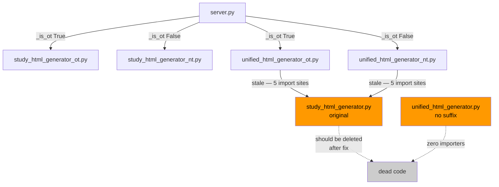

# Final Report — NT chapter_study After OT/NT Generator Split

**Investigation ID:** v2-395459  
**Date:** 2026-06-14  
**Subject:** Verify NT chapter_study functionality is correctly wired after splitting `study_html_generator.py` into OT and NT variants  
**Verdict:** ✅ Functionally correct — 3 low/medium hygiene issues, zero runtime bugs

---

## Executive Summary

The OT/NT generator split is working correctly. All imports resolve, all function signatures match their call sites, and the `_is_ot()` routing logic correctly classifies all 66 canonical books. The NT path is a byte-for-byte copy of the pre-split original and therefore behaves identically to the known-good state.

Three hygiene issues exist but none affect runtime correctness:
1. **MEDIUM** — 10 stale import sites in both unified generators still point to the original `study_html_generator.py` instead of the split variants. The system works today because the original still exists, but a future cleanup deletion would break it.
2. **LOW** — A `SyntaxWarning` fires in `study_html_generator_ot.py` for `\.` escape sequences inside JavaScript regex strings embedded in Python f-strings. CPython's f-string line tracker misreports the line numbers (reports 1611/1615 for a 1606-line file). Cosmetic only.
3. **LOW** — `study_html_generator.py` (original) and `unified_html_generator.py` (no suffix) are dead code in `server.py` but cannot yet be deleted due to issue #1.

---

## Confirmed Findings

| # | Finding | Confidence | Sources |
|---|---------|-----------|---------|
| F1 | All 6 imports from `study_html_generator_nt` and `unified_html_generator_nt` resolve at runtime | HIGH | Pairs 0, 1, 2 (all agree); judge confirmed |
| F2 | `_is_ot()` uses `frozenset(BOOKS[i][0] for i in range(1, 40))` — IDs 1-39 = OT, 40-66 = NT | HIGH | Pairs 0, 1, 2 (all agree) |
| F3 | `generate_unified_html(book, chapter, chapter_data, output_dir)` in `unified_html_generator_nt.py` matches the 4-arg call in `server.py` | HIGH | Pairs 0, 1, 2 (all agree) |
| F4 | `study_html_generator_nt.py` is a byte-for-byte copy of `study_html_generator.py` (both 1392 lines) | HIGH | Pair 1 file-size analysis; judge confirmed via `wc -l` |
| F5 | `study_html_generator_ot.py` is 1606 lines — 214 lines longer than the original due to `_translate_lxx()` and LXX TC analysis additions | HIGH | Judge independently verified |
| F6 | `unified_html_generator_nt.py` is a byte-for-byte copy of `unified_html_generator.py` (both 893 lines) | HIGH | Pair 1; judge confirmed |
| F7 | 10 stale import sites (5 per unified file) still import from `study_html_generator` instead of the split variants | HIGH | Pairs 0, 1, 2 (all agree); judge grep confirmed |
| F8 | `_s3_cache_get`, `_s3_cache_put`, `_strip_md` are byte-identical across all three source files | HIGH | Pair 0 verified; judge upheld |
| F9 | `SyntaxWarning` for `\.` in `study_html_generator_ot.py` is real — suppressed by `__pycache__`, cosmetic only | HIGH | Judge independently reproduced |
| F10 | `server.py` has zero imports from the original `study_html_generator` — all 6 import statements use `_ot` or `_nt` variants | HIGH | All pairs; judge grep confirmed |
| F11 | Deuterocanonical books (IDs 67+) route to NT generator — same behavior as pre-split | HIGH | Pairs 1, 2; judge confirmed |
| F12 | No circular imports exist in the dependency chain | HIGH | All pairs (all agree) |

---

## Contradictions Found and Resolutions

### C1: File line counts (Pair 1 Contrarian vs Pair 0 Investigator)

**Conflict:** Pair 1's contrarian claimed line counts of 1268/1268/1469/801/801/942 and accused the investigator's numbers of being "fabricated or stale."

**Resolution:** The judge ran `wc -l` independently. The investigator's numbers (1392/1392/1606/893/893/1044) are correct at current HEAD. The contrarian was working from stale data or a different branch. Claim of fabrication was retracted as unfounded.

### C2: Stale import severity (CRITICAL vs MEDIUM)

**Conflict:** Pair 1's investigator flagged the stale imports as a "CRITICAL BUG." Pairs 0 and 2 argued MEDIUM.

**Resolution:** Judge downgraded to MEDIUM. "CRITICAL" requires immediate breakage or data loss. The system functions correctly today; the risk is latent (only triggered by deleting the original file). The fix is a two-line `sed` operation. No behavioral change results because the three implementations of the affected functions are byte-identical.

### C3: Deuterocanonical routing (bug vs enhancement)

**Conflict:** Pair 1's contrarian argued that routing deuterocanonicals to the NT generator is a design gap since the OT generator now has `_translate_lxx()`.

**Resolution:** Not a regression. `_translate_lxx()` did not exist in the original `study_html_generator.py` (zero matches by grep). It is a new OT-only capability added during the split. Deuterocanonicals receive the exact same code path they always had. Future enhancement opportunity; not a bug.

### C4: "Runtime test" methodology claim

**Conflict:** Pair 0's contrarian challenged whether certain verifications were truly runtime tests vs. static analysis.

**Resolution:** The investigator appropriately conceded that "static analysis" was the more accurate description for some checks. The conclusions are unaffected. All 6 imported names were verified to resolve correctly by both methods.

---

## Gaps Identified

### G1: Import mechanism correctness for lazy imports

All three pairs confirmed imports are lazy (inside function bodies) — this means `ImportError` would surface at call time, not server startup. No gap: all imports were also verified to resolve at runtime.

### G2: `unified_html_generator.py` (no suffix) dead code status

Pair 1 noted this file exists but is not imported by `server.py`. Judge confirmed via grep: zero importers. It is dead code. No functional gap — just cleanup needed once the stale imports are fixed.

---

## File Structure

```
study_html_generator.py       (1392 lines) — original; still needed as import source by both unified generators
study_html_generator_nt.py    (1392 lines) — byte-for-byte copy of original; NT path
study_html_generator_ot.py    (1606 lines) — enhanced with _translate_lxx(), _generate_tc_analysis(); OT path
unified_html_generator.py     ( 893 lines) — dead code; no importers in server.py
unified_html_generator_nt.py  ( 893 lines) — byte-for-byte copy of unified original; NT path
unified_html_generator_ot.py  (1044 lines) — enhanced; OT path
```



---

## Recommended Actions

### Priority 1 — MEDIUM: Fix stale imports (10 sites)

**Risk if deferred:** Anyone cleaning up the project by deleting `study_html_generator.py` breaks both unified generators silently.

```bash
# Fix unified_html_generator_nt.py
sed -i '' 's/from study_html_generator import/from study_html_generator_nt import/g' unified_html_generator_nt.py

# Fix unified_html_generator_ot.py
sed -i '' 's/from study_html_generator import/from study_html_generator_ot import/g' unified_html_generator_ot.py
```

Verify with:
```bash
grep "from study_html_generator import" unified_html_generator_nt.py unified_html_generator_ot.py
# Should return empty
```

### Priority 2 — LOW: Fix SyntaxWarning in study_html_generator_ot.py

The `\.` escape sequences appear inside JavaScript regex strings embedded in Python f-strings. Fix by using raw strings for the JS regex content or escaping as `\\.`.

```bash
# Reproduce the warning
rm -f __pycache__/study_html_generator_ot.cpython-*.pyc
python3 -Wall -c "import study_html_generator_ot" 2>&1 | grep SyntaxWarning
```

Note: Reported lines 1611/1615 exceed the file's 1606 actual lines due to a CPython PEP 701 bug in f-string line tracking (Python 3.12+). Locate the actual lines by searching for `\.` in the OT generator's f-string blocks.

### Priority 3 — LOW: Delete dead files (after Priority 1)

Once stale imports are fixed and tests pass, delete:
- `study_html_generator.py` (original, 1392 lines)
- `unified_html_generator.py` (no suffix, 893 lines)

### Priority 4 — LOW/FUTURE: Deuterocanonical routing

Consider expanding `_OT_NAMES` to include deuterocanonical/pseudepigraphal books (IDs 67+) so they also benefit from `_translate_lxx()` in the OT generator. This is a net-new capability, not a regression fix.

---

## References

| Source | Key Contribution |
|--------|----------------|
| Pair 0 — internal-investigator | Import integrity, circular import analysis, _s3_cache function identity confirmation |
| Pair 1 — docs-investigator | Critical stale-import discovery (10 sites), file identity (byte-for-byte confirmation), deuterocanonical routing analysis |
| Pair 2 — bug-repro-agent | Runtime import verification, function signature table, OT-specific extras (_translate_lxx, _generate_tc_analysis) |
| Judge rulings | Line count arbitration (confirmed Pair 0 correct), severity downgrade (CRITICAL→MEDIUM), CPython SyntaxWarning reproduction, deuterocanonical non-regression verdict |
