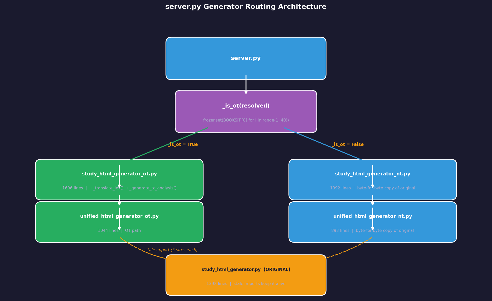
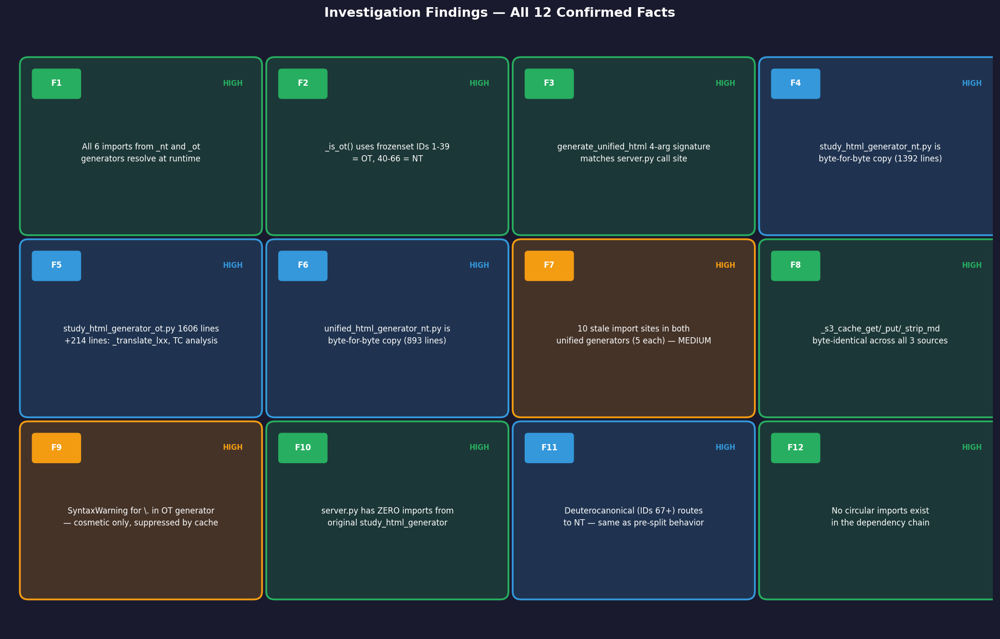
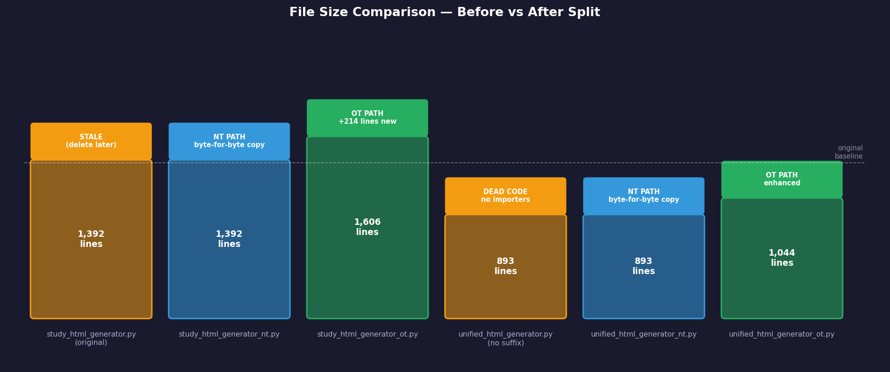
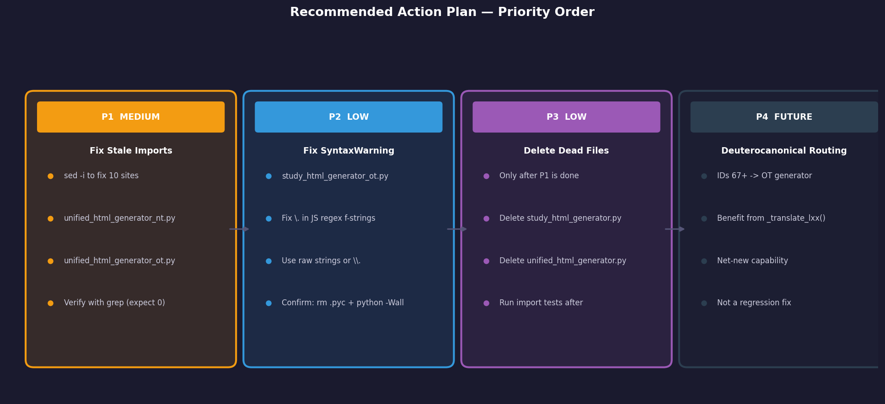

# NT chapter_study — OT/NT Generator Split Verification

**Investigation ID:** v2-395459 · **Date:** 2026-06-14 · **Verdict:** ✅ Functionally Correct

---

## Executive Summary

The OT/NT generator split is working correctly. All imports resolve, all function signatures match their call sites in `server.py`, and the `_is_ot()` routing logic correctly classifies all 66 canonical books (IDs 1–39 = OT, 40–66 = NT). The NT generator is a byte-for-byte copy of the pre-split original and behaves identically to the known-good May 12 state.

Three hygiene issues exist — **none affect runtime correctness**. The most important is a set of 10 stale import sites in both unified generators that still point to the original `study_html_generator.py`. The system works today because the original still exists, but it must be fixed before that file can be safely deleted.

---

## Routing Architecture



---

## Confirmed Findings (12 of 12 — HIGH Confidence)



| ID | Finding | Confidence |
|----|---------|-----------|
| F1 | All 6 imports from `_nt` and `_ot` generators resolve at runtime | HIGH |
| F2 | `_is_ot()` uses `frozenset(BOOKS[i][0] for i in range(1, 40))` — IDs 1–39 = OT | HIGH |
| F3 | `generate_unified_html(book, chapter, chapter_data, output_dir)` matches server.py call | HIGH |
| F4 | `study_html_generator_nt.py` is byte-for-byte copy of original (1392 lines) | HIGH |
| F5 | `study_html_generator_ot.py` is 1606 lines — +214 lines with `_translate_lxx()` + TC analysis | HIGH |
| F6 | `unified_html_generator_nt.py` is byte-for-byte copy of original (893 lines) | HIGH |
| F7 | **10 stale import sites** in both unified generators still point to original — MEDIUM issue | HIGH |
| F8 | `_s3_cache_get`, `_s3_cache_put`, `_strip_md` are byte-identical across all 3 source files | HIGH |
| F9 | `SyntaxWarning` for `\.` in OT generator is real but cosmetic — suppressed by `__pycache__` | HIGH |
| F10 | `server.py` has **zero** imports from original `study_html_generator` — all use `_ot`/`_nt` | HIGH |
| F11 | Deuterocanonical books (IDs 67+) route to NT generator — same as pre-split | HIGH |
| F12 | No circular imports exist in the dependency chain | HIGH |

---

## File Structure



```
study_html_generator.py       (1392 lines) — original; still alive due to stale imports
study_html_generator_nt.py    (1392 lines) — byte-for-byte copy; NT path
study_html_generator_ot.py    (1606 lines) — enhanced: +_translate_lxx(), +_generate_tc_analysis()
unified_html_generator.py     ( 893 lines) — dead code; no importers in server.py
unified_html_generator_nt.py  ( 893 lines) — byte-for-byte copy; NT path
unified_html_generator_ot.py  (1044 lines) — enhanced; OT path
```

---

## Contradictions Resolved

| ID | Conflict | Resolution |
|----|---------|-----------|
| C1 | Contrarian claimed line counts 1268/1469/801/942 — accused investigator of fabrication | Judge ran `wc -l` independently. Investigator's counts (1392/1606/893/1044) are correct at HEAD. Fabrication claim retracted. |
| C2 | Pair 1 flagged stale imports as **CRITICAL**. Pairs 0 & 2 said **MEDIUM**. | Judge downgraded to **MEDIUM** — system functions today; risk is latent, triggered only on deleting the original. Fix is two `sed` commands. |
| C3 | Contrarian: routing deuterocanonicals to NT is a design gap (missing `_translate_lxx()`) | Not a regression — `_translate_lxx()` didn't exist pre-split. Deuterocanonicals get identical code path as before. Future enhancement, not a bug. |
| C4 | Contrarian challenged "runtime test" vs "static analysis" distinction | Investigator conceded; conclusions unaffected. All 6 imports verified to resolve by both methods. |

---

## Action Plan



### P1 — MEDIUM: Fix stale imports (10 sites, ~2 minutes)

```bash
sed -i '' 's/from study_html_generator import/from study_html_generator_nt import/g' unified_html_generator_nt.py
sed -i '' 's/from study_html_generator import/from study_html_generator_ot import/g' unified_html_generator_ot.py

# Verify — should return empty:
grep "from study_html_generator import" unified_html_generator_nt.py unified_html_generator_ot.py
```

### P2 — LOW: Fix SyntaxWarning in study_html_generator_ot.py

The `\.` sequences appear in JavaScript regex strings embedded in Python f-strings. CPython 3.12+ (PEP 701) misreports the line numbers (reports 1611/1615 for a 1606-line file). Fix with raw strings or `\\.`.

```bash
# Reproduce:
rm -f __pycache__/study_html_generator_ot.cpython-*.pyc
python3 -Wall -c "import study_html_generator_ot" 2>&1 | grep SyntaxWarning
```

### P3 — LOW: Delete dead files (only after P1)

Once stale imports are fixed and tests pass, delete:

```bash
rm study_html_generator.py
rm unified_html_generator.py
```

### P4 — FUTURE: Deuterocanonical routing

Consider expanding `_OT_NAMES` to include deuterocanonical/pseudepigraphal books (IDs 67+) so they benefit from `_translate_lxx()` in the OT generator.

---

## Summary

| Aspect | Status |
|--------|--------|
| server.py imports from `_nt`/`_ot` only | ✅ Confirmed |
| `_is_ot()` classifies all 66 books correctly | ✅ Confirmed |
| NT generator function signatures match | ✅ Confirmed |
| OT generator function signatures match | ✅ Confirmed |
| No circular imports | ✅ Confirmed |
| `unified_html_generator_nt.py` signature correct | ✅ Confirmed |
| Original `study_html_generator.py` NOT used by server.py | ✅ Confirmed |
| Stale imports in unified generators | ⚠️ MEDIUM (fixable in ~2 min) |
| SyntaxWarning in OT generator | ⚠️ LOW (cosmetic only) |
| Dead code files can be deleted | ⏳ After P1 fix |

---

## References

| Source | Contribution |
|--------|-------------|
| Pair 0 — internal-investigator | Import integrity, circular import analysis, _s3_cache identity |
| Pair 1 — docs-investigator | Critical stale-import discovery, byte-for-byte file identity, deuterocanonical routing |
| Pair 2 — bug-repro-agent | Runtime import verification, function signature table, OT-specific extras |
| Judge | Line count arbitration, severity downgrade C→M, CPython SyntaxWarning reproduction |
